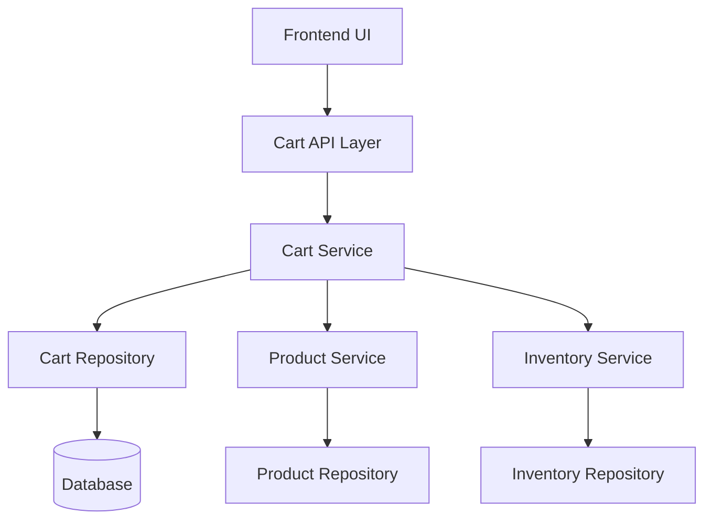
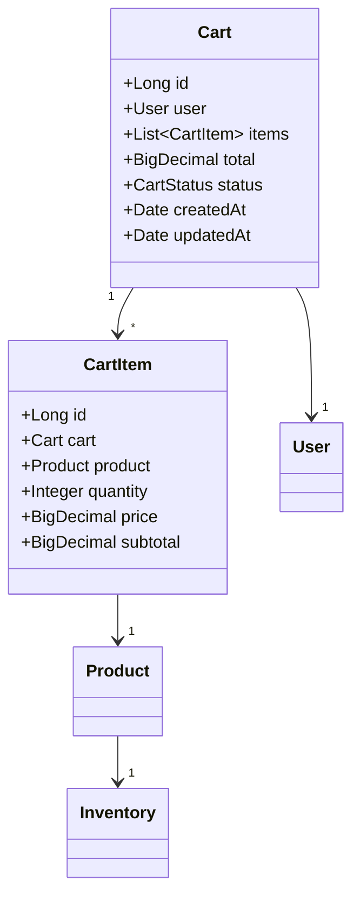

# Shopping Cart - High Level Design

## Overview
The shopping cart system enables users to select, manage and purchase products through an intuitive and reliable interface.

## System Architecture



## Core Components

### 1. Cart Service
- Manages cart operations (add/remove/update items)
- Validates product availability and quantity
- Calculates totals, taxes, and shipping
- Handles cart merging for logged-in users
- Maintains cart expiry and cleanup

### 2. Data Models



## Key Features

1. **Cart Management**
   - Add/Remove items
   - Update quantities
   - Clear cart
   - Save for later
   - Move to wishlist

2. **Price Calculation**
   - Real-time product price updates
   - Tax calculation
   - Shipping cost estimation
   - Promotion/discount application

3. **Inventory Integration**
   - Real-time stock checking
   - Reserved stock management
   - Out-of-stock handling

4. **User Session Handling**
   - Anonymous cart support
   - Cart merging on login
   - Multi-device sync
   - Cart persistence

## API Endpoints

### Cart Operations
```
POST   /api/cart/items           # Add item to cart
PUT    /api/cart/items/{id}      # Update cart item
DELETE /api/cart/items/{id}      # Remove from cart
GET    /api/cart                 # Get cart details
POST   /api/cart/clear           # Clear cart
```

### Cart Item Operations
```
POST   /api/cart/items/{id}/save-for-later
POST   /api/cart/items/{id}/move-to-wishlist
```

## Security Considerations

1. **Authentication & Authorization**
   - Anonymous cart access via session tokens
   - Secure cart merging process
   - Rate limiting for cart operations

2. **Data Protection**
   - Price manipulation prevention
   - Quantity limit enforcement
   - Session fixation protection

3. **Inventory Protection**
   - Stock level verification
   - Temporary stock reservation
   - Concurrent access handling

## Performance Optimization

1. **Caching Strategy**
   - Cart data caching
   - Product price caching
   - Inventory level caching

2. **Database Optimization**
   - Efficient indexing
   - Regular cleanup of abandoned carts
   - Archiving old cart data

3. **Scalability**
   - Horizontal scaling support
   - Load balancing
   - Database sharding preparation

## Error Handling

1. **Common Scenarios**
   - Product out of stock
   - Invalid quantities
   - Price changes during session
   - Session expiration

2. **Error Responses**
   - Clear error messages
   - Suggested actions
   - Automatic retry mechanisms

## Metrics & Monitoring

1. **Key Metrics**
   - Cart abandonment rate
   - Average cart value
   - Cart completion time
   - Error rates

2. **Alerting**
   - High cart abandonment
   - Unusual error rates
   - Performance degradation
   - Stock-related issues

## Future Enhancements

1. **Feature Roadmap**
   - Real-time inventory updates
   - Advanced pricing rules
   - Multi-currency support
   - Cart sharing capabilities

2. **Technical Improvements**
   - Event sourcing implementation
   - Enhanced caching strategy
   - Performance optimizations
   - Mobile-specific optimizations
