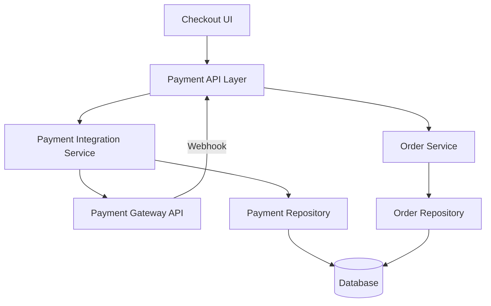

# Payment Gateway Integration - High Level Design

## Overview
Integrate with third-party payment gateways (e.g., Stripe, PayPal) to securely process customer payments for orders.

## System Architecture

## Core Components
1.  **Payment Integration Service:** Handles communication with payment gateways, processes payments, manages payment statuses, and handles callbacks/webhooks.
2.  **Payment Repository:** Stores payment transaction details and statuses.
3.  **Order Service:** Updates order status based on payment success/failure.

## Key Features
- Support multiple payment methods (Credit Card, PayPal, etc.)
- Secure payment processing
- Handle payment success, failure, and pending states
- Refund processing
- Store partial payment details securely (e.g., last 4 digits, card type)
- Webhook handling for asynchronous updates

## API Endpoints
- `POST /api/payments/initiate`
- `POST /api/payments/confirm`
- `GET /api/payments/{transactionId}`
- `POST /api/payments/refund`
- `POST /api/payments/webhook`

## Security Considerations
- PCI DSS Compliance (if handling card data directly, though typically offloaded to gateway)
- Secure handling of API keys/secrets for payment gateways
- Protection against replay attacks on callbacks
- Fraud detection integration
- Secure storage of transaction data

## Data Models (Conceptual)
- `PaymentTransaction` (Transaction ID, Order ID, User ID, Gateway, Amount, Currency, Status, Gateway Ref, Timestamp)
- `PaymentMethod` (User ID, Type, Details (Token/Masked), Default Flag)

## Future Enhancements
- Add more payment gateways
- Implement subscription/recurring payments
- Wallet integration
- Buy Now Pay Later (BNPL) options
