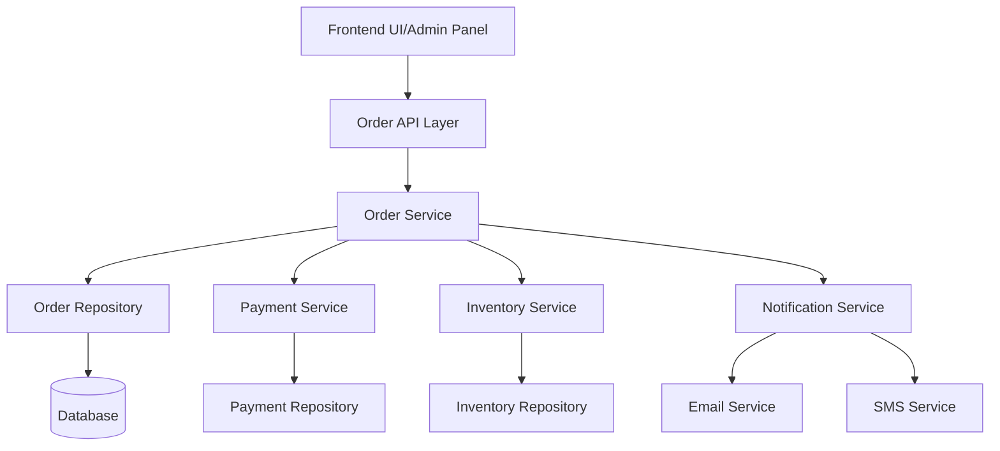

# Enhanced Order Management - High Level Design

## Overview
Manage the lifecycle of customer orders from placement through fulfillment, including status tracking, updates, and history.

## System Architecture

## Core Components
1.  **Order Service:** Creates orders, updates statuses, manages order items, calculates totals, interacts with other services (Payment, Inventory, Notification).
2.  **Order Repository:** Stores order details, items, statuses, and history.
3.  **Notification Service:** Sends order confirmations, shipping updates, etc.

## Key Features
- Order creation from cart
- Multiple order statuses (Pending, Processing, Shipped, Delivered, Cancelled, Refunded)
- Order history for users
- Order tracking information
- Order modification (limited, e.g., cancellation before shipping)
- Invoice generation
- Return and refund management integration

## API Endpoints
- `POST /api/orders` (Create order from cart)
- `GET /api/orders` (List user's orders)
- `GET /api/orders/{orderId}` (Get specific order details)
- `POST /api/orders/{orderId}/cancel` (Cancel order)
- `GET /api/admin/orders` (Admin: List all orders)
- `PUT /api/admin/orders/{orderId}/status` (Admin: Update order status)
- `GET /api/admin/orders/{orderId}/history` (Admin: View order history)

## Security Considerations
- Ensure users can only access their own orders.
- Secure admin endpoints with role-based access control.
- Protect sensitive order data.
- Validate status transitions.

## Data Models (Conceptual)
- `WebOrder` (Order ID, User ID, Order Date, Status, Total Amount, Shipping Address, Billing Address)
- `OrderItem` (Order Item ID, Order ID, Product ID, Quantity, Price, Subtotal)
- `OrderStatusHistory` (History ID, Order ID, Status, Timestamp, Notes)

## Future Enhancements
- Partial shipments
- Order splitting
- Integration with shipping carriers API
- Automated fraud analysis on orders
