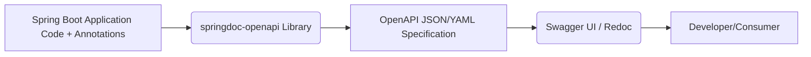

# API Documentation Strategy - High Level Design

## Overview
Establish a strategy and implement tools for generating comprehensive, accurate, and interactive API documentation, likely using OpenAPI (Swagger).

## Goal
Provide clear documentation for all backend APIs to facilitate frontend development, third-party integrations, and internal understanding.

## Chosen Tool: Springdoc OpenAPI
Leverage the `springdoc-openapi` library which integrates seamlessly with Spring Boot and automatically generates OpenAPI 3 documentation from code annotations.

## Architecture

## Core Components
1.  **Springdoc OpenAPI Library:** Integrated into the build (`pom.xml`), scans controllers and models.
2.  **Annotations:** Use `@Operation`, `@Parameter`, `@ApiResponse`, `@Schema`, etc., within the controller and model code to describe endpoints and data structures.
3.  **Configuration:** Global OpenAPI configuration (e.g., API info, security schemes) defined in a Java configuration class or `application.properties`.
4.  **Swagger UI:** The interactive web interface provided by `springdoc-openapi-starter-webmvc-ui` accessible at a specific endpoint (e.g., `/swagger-ui.html`).

## Key Features
- Automatic generation of OpenAPI spec from code.
- Interactive UI (Swagger UI) for exploring and testing APIs.
- Documentation of request/response models, parameters, and status codes.
- Support for documenting security schemes (e.g., JWT Bearer).
- Versioning support.

## Implementation Strategy
- Add `springdoc-openapi-starter-webmvc-ui` dependency.
- Create a global configuration class (`@OpenAPIDefinition`).
- Annotate all existing and new REST controllers and DTOs thoroughly.
- Define security schemes used (JWT).
- Regularly review and update documentation as APIs evolve.

## API Endpoint (for Documentation UI)
- `GET /swagger-ui.html` (Or configured path)
- `GET /v3/api-docs` (Raw OpenAPI specification)

## Security Considerations
- Decide if the documentation UI should be exposed in production environments. If so, secure access appropriately (e.g., behind admin authentication).

## Data Models (Conceptual)
- The documentation describes the existing API DTOs. No new models are introduced specifically for documentation itself, beyond configuration objects.

## Future Enhancements
- Integrate Redoc UI as an alternative.
- Automate documentation checks in CI/CD pipeline.
- Generate client SDKs from the OpenAPI spec.
