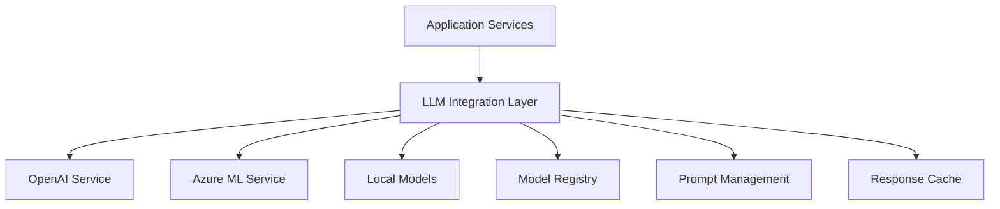
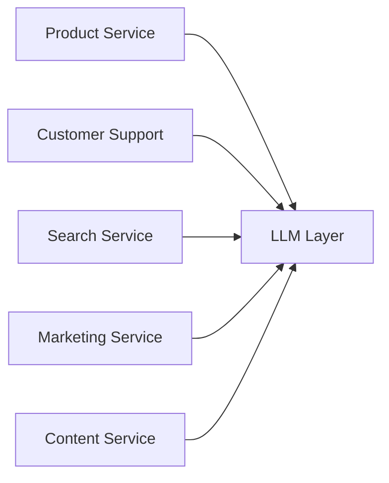
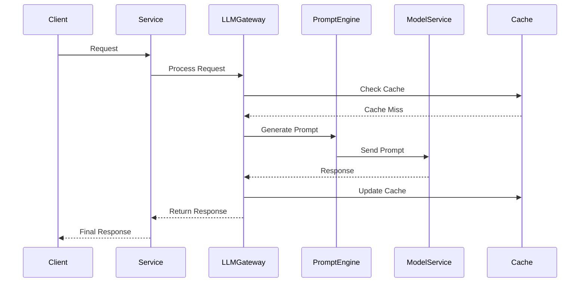

# AI/LLM Integration Architecture - High Level Design

## System Overview
This document outlines the architectural design for integrating Large Language Models (LLMs) into the e-commerce platform, focusing on scalability, reliability, and maintainability.

## Architecture Components

### 1. Core LLM Integration Layer



Key Components:
- Model Registry: Manages different LLM models and versions
- Prompt Management: Templates and version control for prompts
- Response Cache: Caches common responses for performance
- Fallback Mechanisms: Handles service disruptions
- Load Balancing: Distributes requests across models/providers

### 2. Service Integration Points



Integration Areas:
- Product Content Generation
- Customer Support Automation
- Semantic Search
- Marketing Content
- Personalization

### 3. Data Flow Architecture



## System Components

### 1. LLM Gateway Service
```java
@Service
public interface LLMGatewayService {
    CompletableFuture<String> processAsync(LLMRequest request);
    String process(LLMRequest request);
    ModelCapabilities getModelCapabilities(String modelId);
    void validateRequest(LLMRequest request);
}
```

### 2. Prompt Management
```java
@Service
public interface PromptManagementService {
    String getPrompt(String templateId, Map<String, Object> variables);
    void registerTemplate(PromptTemplate template);
    void validateTemplate(String templateId);
    PromptMetrics getTemplateMetrics(String templateId);
}
```

### 3. Response Cache
```java
@Service
public interface ResponseCacheService {
    Optional<String> get(String key, String context);
    void store(String key, String context, String response);
    void invalidate(String key);
    CacheMetrics getMetrics();
}
```

## Performance Considerations

### 1. Caching Strategy
- Response caching with context-aware invalidation
- Prompt template caching
- Model response caching
- Distributed caching for scale

### 2. Rate Limiting
```yaml
rate-limiting:
  default:
    requests-per-second: 50
    burst-size: 100
  premium:
    requests-per-second: 100
    burst-size: 200
```

### 3. Load Balancing
- Round-robin across multiple LLM providers
- Cost-based routing
- Performance-based routing
- Fallback strategies

## Monitoring & Observability

### 1. Metrics Collection
```java
@Component
public class LLMMetrics {
    // Request metrics
    private final Counter requestsTotal;
    private final Counter requestsSuccess;
    private final Counter requestsFailure;
    
    // Performance metrics
    private final Timer responseTime;
    private final Gauge modelLatency;
    private final Counter tokenUsage;
    
    // Cost metrics
    private final Counter apiCosts;
}
```

### 2. Logging Strategy
```java
@Aspect
@Component
public class LLMLoggingAspect {
    @Around("execution(* com.flipkart.ecommerce_backend.llm.*.*(..))")
    public Object logLLMOperation(ProceedingJoinPoint joinPoint) {
        // Log request, response, timing, etc.
    }
}
```

## Security Considerations

### 1. Data Protection
- PII detection and removal
- Prompt injection prevention
- Response validation
- Data retention policies

### 2. Access Control
```java
@Configuration
public class LLMSecurityConfig {
    @Bean
    public LLMAccessControlService llmAccessControl() {
        return new LLMAccessControlService(
            new RequestValidator(),
            new ResponseSanitizer(),
            new TokenValidator()
        );
    }
}
```

## Cost Optimization

### 1. Token Management
```java
@Service
public class TokenOptimizationService {
    public String optimizePrompt(String prompt, TokenBudget budget);
    public boolean validateTokenUsage(String text, TokenLimit limit);
    public TokenUsageReport generateReport(String modelId, DateRange range);
}
```

### 2. Cost Allocation
```java
@Service
public class CostTrackingService {
    public void trackUsage(String service, int tokens, String modelId);
    public CostReport generateCostReport(String service, DateRange range);
    public void enforcebudgetLimits(String service, Budget budget);
}
```

## Error Handling

### 1. Retry Mechanism
```java
@Configuration
public class RetryConfig {
    @Bean
    public RetryTemplate llmRetryTemplate() {
        return RetryTemplate.builder()
            .exponentialBackoff(100, 2, 1000)
            .maxAttempts(3)
            .build();
    }
}
```

### 2. Fallback Strategy
```java
@Service
public class LLMFallbackService {
    public String provideFallback(String service, Exception e);
    public void notifyFailure(String service, Exception e);
    public void switchProvider(String currentProvider);
}
```

## Integration Guidelines

1. Service Integration:
   - Use async processing for non-blocking operations
   - Implement circuit breakers for external calls
   - Cache responses where appropriate
   - Monitor token usage and costs

2. Error Handling:
   - Implement graceful degradation
   - Provide meaningful fallbacks
   - Log errors with context
   - Monitor error rates

3. Performance:
   - Use connection pooling
   - Implement request batching
   - Cache frequently used responses
   - Monitor response times

4. Security:
   - Validate all inputs
   - Sanitize outputs
   - Implement rate limiting
   - Monitor for abuse

## Deployment Considerations

1. Infrastructure:
   - Scalable cloud resources
   - Multiple regions for redundancy
   - Auto-scaling capabilities
   - Load balancing

2. Monitoring:
   - Real-time metrics
   - Alert thresholds
   - Cost monitoring
   - Performance tracking

3. Updates:
   - Zero-downtime deployments
   - Rollback capabilities
   - Version management
   - A/B testing support
