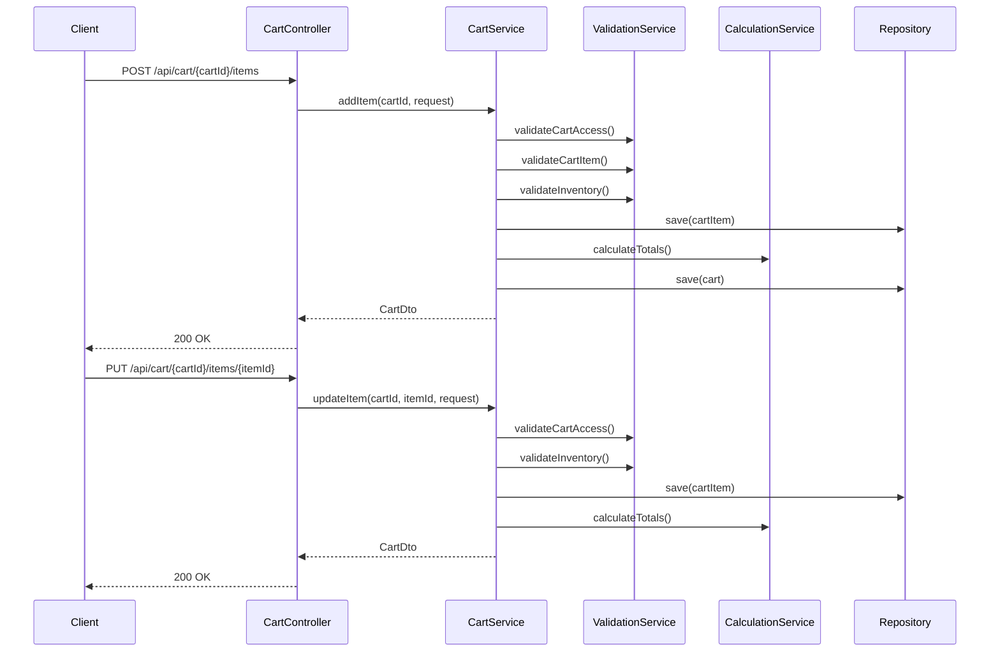
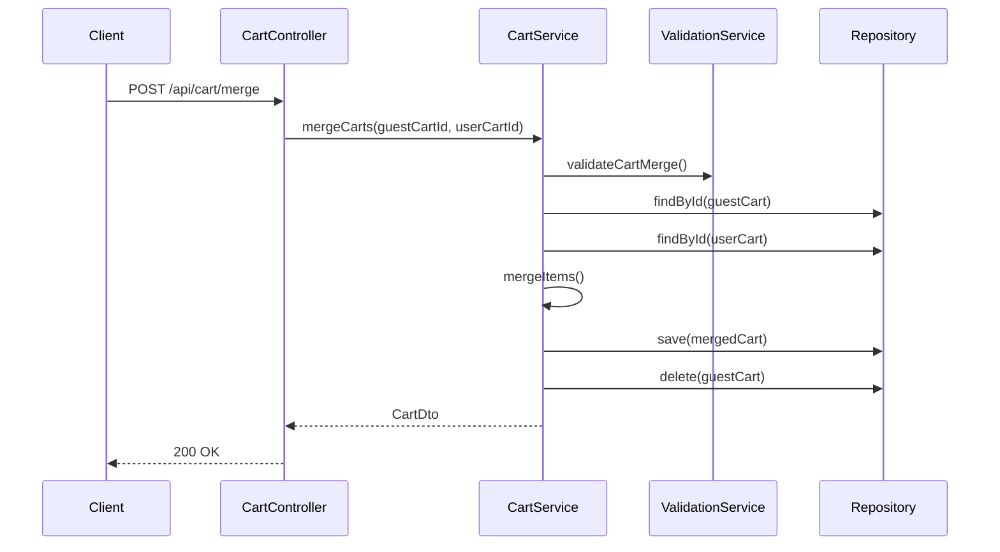

# Shopping Cart Controller - Low Level Design

## Cart Operations Flow



## Cart Merge Flow



## REST Controller

```java
@RestController
@RequestMapping("/api/cart")
@Validated
public class CartController {
    private final CartService cartService;
    private final CartDtoMapper mapper;

    public CartController(CartService cartService, CartDtoMapper mapper) {
        this.cartService = cartService;
        this.mapper = mapper;
    }

    @PostMapping
    @ResponseStatus(HttpStatus.CREATED)
    public CartDto createCart(@RequestBody @Valid CreateCartRequest request) {
        return cartService.createCart(request.getUserId());
    }

    @GetMapping("/{cartId}")
    public CartDto getCart(
        @PathVariable Long cartId,
        @RequestParam Long userId
    ) {
        return cartService.getCart(cartId);
    }

    @PostMapping("/{cartId}/items")
    public CartDto addItem(
        @PathVariable Long cartId,
        @RequestBody @Valid CartItemRequest request
    ) {
        return cartService.addItem(cartId, request);
    }

    @PutMapping("/{cartId}/items/{itemId}")
    public CartDto updateItem(
        @PathVariable Long cartId,
        @PathVariable Long itemId,
        @RequestBody @Valid CartItemUpdateRequest request
    ) {
        return cartService.updateItem(cartId, itemId, request);
    }

    @DeleteMapping("/{cartId}/items/{itemId}")
    @ResponseStatus(HttpStatus.NO_CONTENT)
    public void removeItem(
        @PathVariable Long cartId,
        @PathVariable Long itemId,
        @RequestParam Long userId
    ) {
        cartService.removeItem(cartId, itemId);
    }

    @PostMapping("/{cartId}/clear")
    @ResponseStatus(HttpStatus.NO_CONTENT)
    public void clearCart(
        @PathVariable Long cartId,
        @RequestParam Long userId
    ) {
        cartService.clearCart(cartId);
    }

    @PostMapping("/merge")
    public CartDto mergeCarts(@RequestBody @Valid MergeCartsRequest request) {
        return cartService.mergeCarts(
            request.getGuestCartId(),
            request.getUserCartId()
        );
    }

    @PostMapping("/{cartId}/items/{itemId}/save-for-later")
    @ResponseStatus(HttpStatus.NO_CONTENT)
    public void saveForLater(
        @PathVariable Long cartId,
        @PathVariable Long itemId,
        @RequestParam Long userId
    ) {
        cartService.saveForLater(cartId, itemId);
    }

    @PostMapping("/{cartId}/items/{itemId}/move-to-wishlist")
    @ResponseStatus(HttpStatus.NO_CONTENT)
    public void moveToWishlist(
        @PathVariable Long cartId,
        @PathVariable Long itemId,
        @RequestParam Long userId
    ) {
        cartService.moveToWishlist(cartId, itemId);
    }
}
```

## Request Validation

```java
public class CreateCartRequest {
    @NotNull(message = "User ID is required")
    private Long userId;
}

public class MergeCartsRequest {
    @NotNull(message = "Guest cart ID is required")
    private Long guestCartId;

    @NotNull(message = "User cart ID is required")
    private Long userCartId;
}

public class CartItemRequest {
    @NotNull(message = "User ID is required")
    private Long userId;

    @NotNull(message = "Product ID is required")
    private Long productId;

    @NotNull(message = "Quantity is required")
    @Min(value = 1, message = "Quantity must be at least 1")
    @Max(value = 100, message = "Quantity cannot exceed 100")
    private Integer quantity;
}

public class CartItemUpdateRequest {
    @NotNull(message = "User ID is required")
    private Long userId;

    @NotNull(message = "Quantity is required")
    @Min(value = 0, message = "Quantity cannot be negative")
    @Max(value = 100, message = "Quantity cannot exceed 100")
    private Integer quantity;
}
```

## DTO Mapping

```java
@Component
public class CartDtoMapper {
    private final ProductDtoMapper productMapper;

    public CartDto toDto(Cart cart) {
        CartDto dto = new CartDto();
        dto.setId(cart.getId());
        dto.setUserId(cart.getUserId());
        dto.setItems(cart.getItems().stream()
            .map(this::toCartItemDto)
            .collect(Collectors.toList()));
        dto.setSubtotal(cart.getSubtotal());
        dto.setTax(cart.getTax());
        dto.setShipping(cart.getShipping());
        dto.setTotal(cart.getTotal());
        dto.setStatus(cart.getStatus());
        return dto;
    }

    private CartItemDto toCartItemDto(CartItem item) {
        CartItemDto dto = new CartItemDto();
        dto.setId(item.getId());
        dto.setProduct(productMapper.toSummaryDto(item.getProduct()));
        dto.setQuantity(item.getQuantity());
        dto.setPrice(item.getPrice());
        dto.setSubtotal(item.getSubtotal());
        return dto;
    }
}
```

## Response Classes

```java
@Data
public class CartDto {
    private Long id;
    private Long userId;
    private List<CartItemDto> items;
    private BigDecimal subtotal;
    private BigDecimal tax;
    private BigDecimal shipping;
    private BigDecimal total;
    private CartStatus status;
    private LocalDateTime createdAt;
    private LocalDateTime updatedAt;
}

@Data
public class CartItemDto {
    private Long id;
    private ProductSummaryDto product;
    private Integer quantity;
    private BigDecimal price;
    private BigDecimal subtotal;
}

@Data
public class ProductSummaryDto {
    private Long id;
    private String name;
    private String imageUrl;
    private BigDecimal price;
    private Boolean inStock;
}
```

## Custom Annotations

```java
@Target({ElementType.METHOD})
@Retention(RetentionPolicy.RUNTIME)
@PreAuthorize("@cartAuthorizationService.canAccessCart(#cartId, #userId)")
public @interface CartAccessCheck {
}
```

## Authorization Service

```java
@Service
public class CartAuthorizationService {
    private final CartRepository cartRepository;

    public boolean canAccessCart(Long cartId, Long userId) {
        return cartRepository.findById(cartId)
            .map(cart -> cart.getUserId().equals(userId))
            .orElse(false);
    }
}
