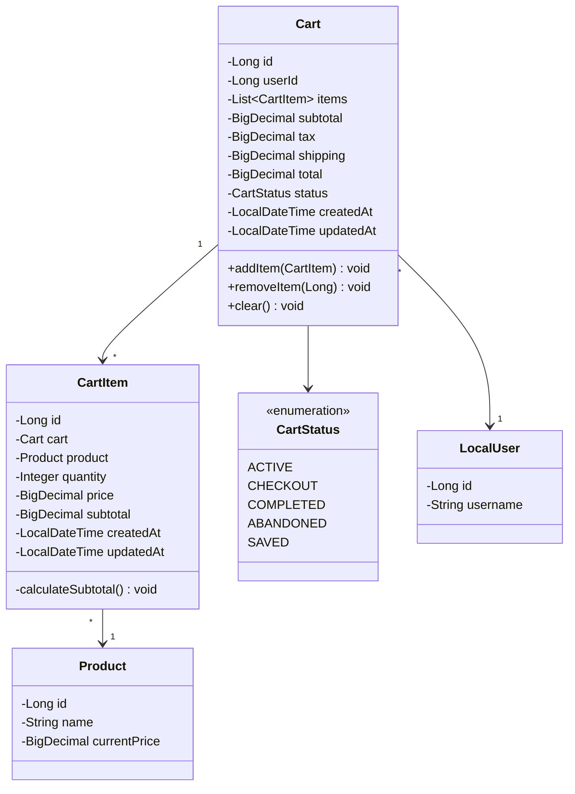

# Shopping Cart Domain Models - Low Level Design

## Domain Model Class Diagram



## Cart Entity

```java
@Entity
@Table(name = "carts")
@Data
@NoArgsConstructor
@EntityListeners(AuditingEntityListener.class) // Assuming JPA Auditing is enabled
public class Cart {
    @Id
    @GeneratedValue(strategy = GenerationType.IDENTITY)
    private Long id;

    @Column(name = "user_id", nullable = false) // Or @ManyToOne if LocalUser is an entity
    private Long userId;

    @OneToMany(
        mappedBy = "cart",
        cascade = CascadeType.ALL,
        orphanRemoval = true,
        fetch = FetchType.LAZY
    )
    private List<CartItem> items = new ArrayList<>();

    @Column(name = "subtotal", precision = 10, scale = 2)
    private BigDecimal subtotal = BigDecimal.ZERO;

    @Column(name = "tax", precision = 10, scale = 2)
    private BigDecimal tax = BigDecimal.ZERO;

    @Column(name = "shipping", precision = 10, scale = 2)
    private BigDecimal shipping = BigDecimal.ZERO;

    @Column(name = "total", precision = 10, scale = 2)
    private BigDecimal total = BigDecimal.ZERO;

    @Enumerated(EnumType.STRING)
    @Column(name = "status", nullable = false, length = 50)
    private CartStatus status = CartStatus.ACTIVE;

    @CreatedDate
    @Column(name = "created_at", nullable = false, updatable = false)
    private LocalDateTime createdAt;

    @LastModifiedDate
    @Column(name = "updated_at")
    private LocalDateTime updatedAt;

    public void addItem(CartItem item) {
        // Check if item already exists, if so, update quantity
        for (CartItem existingItem : items) {
            if (existingItem.getProduct().getId().equals(item.getProduct().getId())) {
                existingItem.setQuantity(existingItem.getQuantity() + item.getQuantity());
                return;
            }
        }
        items.add(item);
        item.setCart(this);
    }

    public void removeItem(Long itemId) {
        items.removeIf(item -> item.getId().equals(itemId));
    }

    public void clear() {
        items.forEach(item -> item.setCart(null));
        items.clear();
    }
}
```

## CartItem Entity

```java
@Entity
@Table(name = "cart_items")
@Data
@NoArgsConstructor
@EntityListeners(AuditingEntityListener.class)
public class CartItem {
    @Id
    @GeneratedValue(strategy = GenerationType.IDENTITY)
    private Long id;

    @ManyToOne(fetch = FetchType.LAZY, optional = false)
    @JoinColumn(name = "cart_id", nullable = false)
    private Cart cart;

    @ManyToOne(fetch = FetchType.LAZY, optional = false)
    @JoinColumn(name = "product_id", nullable = false)
    private Product product; // Assuming Product is an entity

    @Column(name = "quantity", nullable = false)
    @Min(1)
    private Integer quantity;

    @Column(name = "price", nullable = false, precision = 10, scale = 2) // Price at the time of adding to cart
    private BigDecimal price;

    @Column(name = "subtotal", precision = 10, scale = 2)
    private BigDecimal subtotal;

    @CreatedDate
    @Column(name = "created_at", nullable = false, updatable = false)
    private LocalDateTime createdAt;

    @LastModifiedDate
    @Column(name = "updated_at")
    private LocalDateTime updatedAt;

    @PrePersist
    @PreUpdate
    private void calculateSubtotal() {
        if (price != null && quantity != null) {
            this.subtotal = price.multiply(BigDecimal.valueOf(quantity))
                                 .setScale(2, RoundingMode.HALF_UP);
        } else {
            this.subtotal = BigDecimal.ZERO;
        }
    }
}
```

## CartStatus Enum

```java
public enum CartStatus {
    ACTIVE,       // Cart is currently active and can be modified
    CHECKOUT,     // Cart is in the process of checkout
    COMPLETED,    // Cart has been converted to an order
    ABANDONED,    // Cart was abandoned by the user
    SAVED         // Cart was explicitly saved by the user
}
```

## Database Schema (Conceptual)

```mermaid
erDiagram
    CARTS ||--o{ CART_ITEMS : contains
    CART_ITEMS }|--|| PRODUCTS : references
    CARTS }|--|| USERS : belongs_to

    CARTS {
        BIGINT id PK
        BIGINT user_id FK
        DECIMAL(10,2) subtotal
        DECIMAL(10,2) tax
        DECIMAL(10,2) shipping
        DECIMAL(10,2) total
        VARCHAR(50) status
        TIMESTAMP created_at
        TIMESTAMP updated_at
    }

    CART_ITEMS {
        BIGINT id PK
        BIGINT cart_id FK
        BIGINT product_id FK
        INT quantity
        DECIMAL(10,2) price
        DECIMAL(10,2) subtotal
        TIMESTAMP created_at
        TIMESTAMP updated_at
    }

    PRODUCTS {
        BIGINT id PK
        VARCHAR name
        DECIMAL(10,2) current_price
        # ... other product fields
    }

    USERS {
        BIGINT id PK
        VARCHAR username
        # ... other user fields
    }
