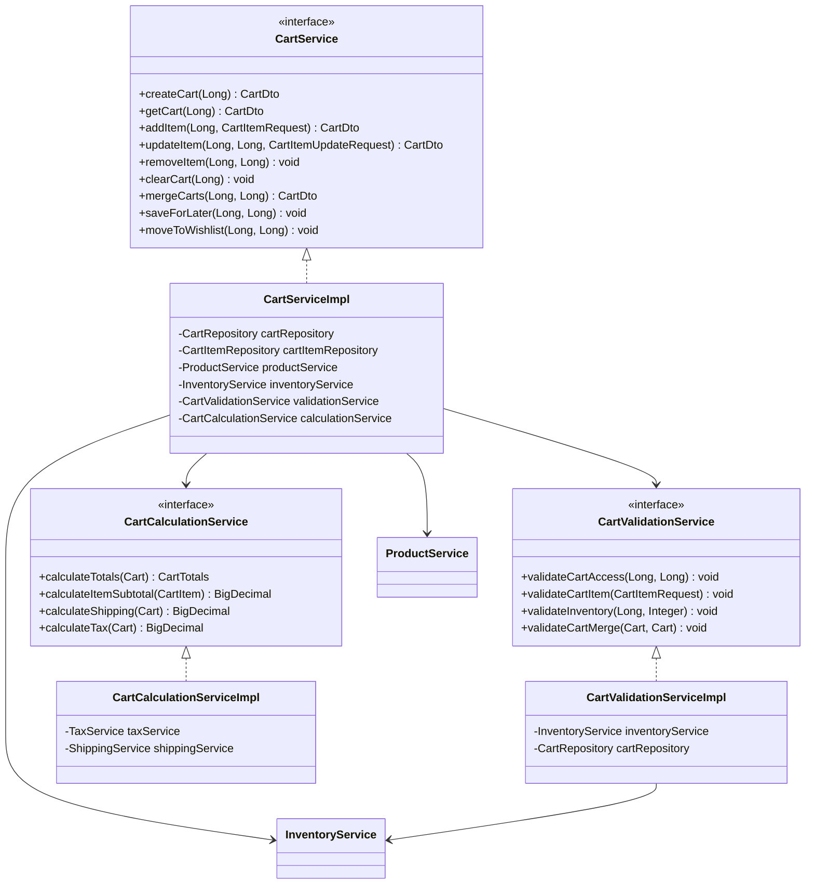

# Shopping Cart Service - Low Level Design

## Service Layer Design



## Service Interfaces

### CartService Interface
```java
public interface CartService {
    CartDto createCart(Long userId);
    CartDto getCart(Long cartId);
    CartDto addItem(Long cartId, CartItemRequest request);
    CartDto updateItem(Long cartId, Long itemId, CartItemUpdateRequest request);
    void removeItem(Long cartId, Long itemId);
    void clearCart(Long cartId);
    CartDto mergeCarts(Long guestCartId, Long userCartId);
    void saveForLater(Long cartId, Long itemId);
    void moveToWishlist(Long cartId, Long itemId);
}
```

### CartValidationService Interface
```java
public interface CartValidationService {
    void validateCartAccess(Long cartId, Long userId);
    void validateCartItem(CartItemRequest request);
    void validateInventory(Long productId, Integer quantity);
    void validateCartMerge(Cart guestCart, Cart userCart);
}
```

### CartCalculationService Interface
```java
public interface CartCalculationService {
    CartTotals calculateTotals(Cart cart);
    BigDecimal calculateItemSubtotal(CartItem item);
    BigDecimal calculateShipping(Cart cart);
    BigDecimal calculateTax(Cart cart);
}
```

## Implementation Classes

### CartServiceImpl
```java
@Service
@Transactional
public class CartServiceImpl implements CartService {
    private final CartRepository cartRepository;
    private final CartItemRepository cartItemRepository;
    private final ProductService productService;
    private final InventoryService inventoryService;
    private final CartValidationService validationService;
    private final CartCalculationService calculationService;

    @Override
    public CartDto addItem(Long cartId, CartItemRequest request) {
        Cart cart = findCart(cartId);
        validationService.validateCartAccess(cart.getId(), request.getUserId());
        validationService.validateCartItem(request);
        validationService.validateInventory(request.getProductId(), request.getQuantity());

        Product product = productService.getProduct(request.getProductId());
        CartItem item = createCartItem(cart, product, request);
        cart.addItem(item);

        cartRepository.save(cart);
        updateCartTotals(cart);

        return CartMapper.toDto(cart);
    }

    @Override
    public CartDto updateItem(Long cartId, Long itemId, CartItemUpdateRequest request) {
        Cart cart = findCart(cartId);
        CartItem item = findCartItem(itemId);
        
        validationService.validateCartAccess(cart.getId(), request.getUserId());
        validationService.validateInventory(item.getProduct().getId(), request.getQuantity());

        item.setQuantity(request.getQuantity());
        item.setSubtotal(calculationService.calculateItemSubtotal(item));
        
        cartItemRepository.save(item);
        updateCartTotals(cart);

        return CartMapper.toDto(cart);
    }

    private void updateCartTotals(Cart cart) {
        CartTotals totals = calculationService.calculateTotals(cart);
        cart.setSubtotal(totals.getSubtotal());
        cart.setTax(totals.getTax());
        cart.setShipping(totals.getShipping());
        cart.setTotal(totals.getTotal());
        cartRepository.save(cart);
    }
}
```

### CartValidationServiceImpl
```java
@Service
public class CartValidationServiceImpl implements CartValidationService {
    private final InventoryService inventoryService;
    private final CartRepository cartRepository;

    @Override
    public void validateCartAccess(Long cartId, Long userId) {
        Cart cart = cartRepository.findById(cartId)
            .orElseThrow(() -> new CartNotFoundException("Cart not found"));

        if (!cart.getUserId().equals(userId)) {
            throw new UnauthorizedAccessException("User not authorized to access this cart");
        }
    }

    @Override
    public void validateInventory(Long productId, Integer quantity) {
        Inventory inventory = inventoryService.getInventory(productId);
        
        if (!inventory.isInStock()) {
            throw new OutOfStockException("Product is out of stock");
        }

        if (inventory.getAvailableQuantity() < quantity) {
            throw new InsufficientInventoryException(
                "Only " + inventory.getAvailableQuantity() + " units available"
            );
        }
    }
}
```

### CartCalculationServiceImpl
```java
@Service
public class CartCalculationServiceImpl implements CartCalculationService {
    private final TaxService taxService;
    private final ShippingService shippingService;

    @Override
    public CartTotals calculateTotals(Cart cart) {
        BigDecimal subtotal = cart.getItems().stream()
            .map(this::calculateItemSubtotal)
            .reduce(BigDecimal.ZERO, BigDecimal::add);

        BigDecimal tax = calculateTax(cart);
        BigDecimal shipping = calculateShipping(cart);
        BigDecimal total = subtotal.add(tax).add(shipping);

        return new CartTotals(subtotal, tax, shipping, total);
    }

    @Override
    public BigDecimal calculateItemSubtotal(CartItem item) {
        return item.getPrice()
            .multiply(BigDecimal.valueOf(item.getQuantity()))
            .setScale(2, RoundingMode.HALF_UP);
    }
}
```

## Data Objects

### Request DTOs
```java
@Data
public class CartItemRequest {
    @NotNull
    private Long userId;
    
    @NotNull
    private Long productId;
    
    @NotNull
    @Min(1)
    private Integer quantity;
}

@Data
public class CartItemUpdateRequest {
    @NotNull
    private Long userId;
    
    @NotNull
    @Min(0)
    private Integer quantity;
}
```

### Response DTOs
```java
@Data
public class CartDto {
    private Long id;
    private Long userId;
    private List<CartItemDto> items;
    private BigDecimal subtotal;
    private BigDecimal tax;
    private BigDecimal shipping;
    private BigDecimal total;
    private CartStatus status;
}

@Data
public class CartItemDto {
    private Long id;
    private ProductSummaryDto product;
    private Integer quantity;
    private BigDecimal price;
    private BigDecimal subtotal;
}

@Data
public class CartTotals {
    private BigDecimal subtotal;
    private BigDecimal tax;
    private BigDecimal shipping;
    private BigDecimal total;
}
```

## Exception Handling

```java
@ControllerAdvice
public class CartExceptionHandler {
    
    @ExceptionHandler(CartNotFoundException.class)
    public ResponseEntity<ErrorResponse> handleCartNotFound(CartNotFoundException ex) {
        ErrorResponse error = new ErrorResponse(
            HttpStatus.NOT_FOUND.value(),
            "CART_NOT_FOUND",
            ex.getMessage()
        );
        return new ResponseEntity<>(error, HttpStatus.NOT_FOUND);
    }
    
    @ExceptionHandler(OutOfStockException.class)
    public ResponseEntity<ErrorResponse> handleOutOfStock(OutOfStockException ex) {
        ErrorResponse error = new ErrorResponse(
            HttpStatus.CONFLICT.value(),
            "PRODUCT_OUT_OF_STOCK",
            ex.getMessage()
        );
        return new ResponseEntity<>(error, HttpStatus.CONFLICT);
    }
}
