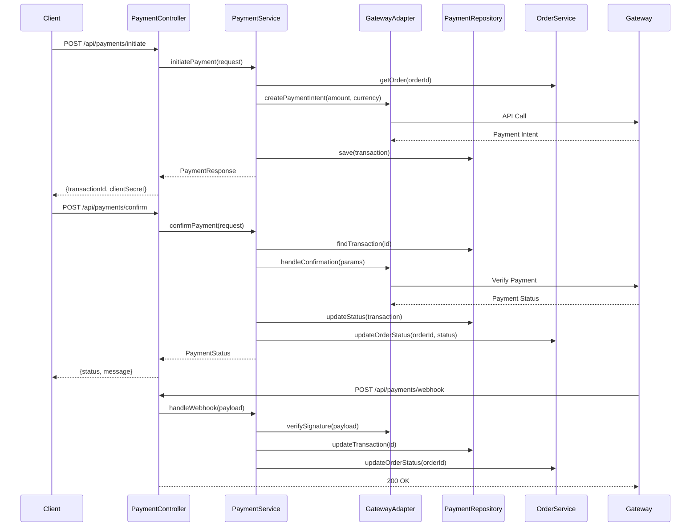

# Payment Controller - Low Level Design

## Payment Flow Sequence

## REST Controller (`PaymentController.java`)
- Endpoints for initiating payment, confirming payment, handling webhooks, processing refunds.
- Request/Response DTOs.
- Validation rules.
- Security considerations (authentication, authorization).

## Request DTOs
- `InitiatePaymentRequest`
- `ConfirmPaymentRequest`
- `RefundRequest`
- `WebhookPayload` (Structure depends on gateway)

## Response DTOs
- `PaymentResponse` (e.g., transaction ID, status, redirect URL)
- `RefundResponse`

## Exception Handling
- Handling payment gateway errors.
- Handling invalid payment states.
- Handling webhook signature verification failures.
