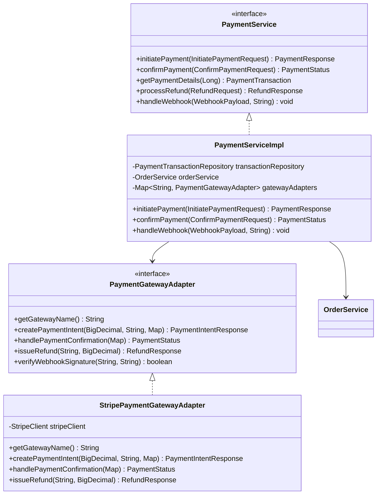

# Payment Service - Low Level Design

## Service Layer Design



## Service Interfaces

### PaymentService Interface
```java
public interface PaymentService {
    PaymentResponse initiatePayment(InitiatePaymentRequest request);
    PaymentStatus confirmPayment(ConfirmPaymentRequest request); // Handles callback/redirect
    PaymentTransaction getPaymentDetails(Long transactionId);
    RefundResponse processRefund(RefundRequest request);
    void handleWebhook(WebhookPayload payload, String signature); // Process gateway webhook
}
```

### PaymentGatewayAdapter Interface (Strategy Pattern)
```java
public interface PaymentGatewayAdapter {
    String getGatewayName(); // e.g., "STRIPE", "PAYPAL"
    PaymentIntentResponse createPaymentIntent(BigDecimal amount, String currency, Map<String, Object> metadata);
    PaymentStatus handlePaymentConfirmation(Map<String, String> confirmationParams);
    RefundResponse issueRefund(String gatewayTransactionId, BigDecimal amount);
    boolean verifyWebhookSignature(String payload, String signature);
}
```

## Implementation Classes

### PaymentServiceImpl
```java
@Service
@Transactional
public class PaymentServiceImpl implements PaymentService {
    private final PaymentTransactionRepository transactionRepository;
    private final OrderService orderService;
    private final Map<String, PaymentGatewayAdapter> gatewayAdapters; // Injected map of adapters

    public PaymentServiceImpl(..., List<PaymentGatewayAdapter> adapters) {
        this.gatewayAdapters = adapters.stream()
            .collect(Collectors.toMap(PaymentGatewayAdapter::getGatewayName, adapter -> adapter));
    }

    @Override
    public PaymentResponse initiatePayment(InitiatePaymentRequest request) {
        PaymentGatewayAdapter adapter = getAdapter(request.getGateway());
        WebOrder order = orderService.getOrder(request.getOrderId());

        // Create PaymentIntent with the gateway
        PaymentIntentResponse intent = adapter.createPaymentIntent(
            order.getTotal(), order.getCurrency(), Map.of("orderId", order.getId().toString())
        );

        // Create and save initial transaction record
        PaymentTransaction transaction = createTransaction(order, request.getGateway(), intent);
        transactionRepository.save(transaction);

        return new PaymentResponse(transaction.getId(), transaction.getStatus(), intent.getClientSecret(), intent.getRedirectUrl());
    }

    @Override
    public PaymentStatus confirmPayment(ConfirmPaymentRequest request) {
        // Logic to handle confirmation based on gateway response/webhook
        // Find transaction, verify, update status, update order status
        PaymentTransaction transaction = findTransaction(request.getTransactionId());
        PaymentGatewayAdapter adapter = getAdapter(transaction.getGateway());

        PaymentStatus status = adapter.handlePaymentConfirmation(request.getConfirmationParams());
        transaction.setStatus(status);
        // Update gateway transaction ID if available
        transactionRepository.save(transaction);

        orderService.updateOrderStatusBasedOnPayment(transaction.getOrder().getId(), status);
        return status;
    }

    @Override
    public void handleWebhook(WebhookPayload payload, String signature) {
        PaymentGatewayAdapter adapter = getAdapter(payload.getGateway());
        if (!adapter.verifyWebhookSignature(payload.getRawBody(), signature)) {
            throw new SecurityException("Invalid webhook signature");
        }

        // Process webhook event (e.g., payment_succeeded, payment_failed)
        // Update transaction status and order status accordingly
    }

    private PaymentGatewayAdapter getAdapter(String gatewayName) {
        PaymentGatewayAdapter adapter = gatewayAdapters.get(gatewayName.toUpperCase());
        if (adapter == null) {
            throw new IllegalArgumentException("Unsupported payment gateway: " + gatewayName);
        }
        return adapter;
    }

    private PaymentTransaction createTransaction(...) { ... }
    private PaymentTransaction findTransaction(...) { ... }
}
```

### StripePaymentGatewayAdapter (Example)
```java
@Component("STRIPE")
public class StripePaymentGatewayAdapter implements PaymentGatewayAdapter {
    // Stripe client configuration and methods

    @Override
    public String getGatewayName() { return "STRIPE"; }

    @Override
    public PaymentIntentResponse createPaymentIntent(...) {
        // Use Stripe SDK to create PaymentIntent
    }

    @Override
    public PaymentStatus handlePaymentConfirmation(...) {
        // Verify Stripe confirmation details
    }

    @Override
    public RefundResponse issueRefund(...) {
        // Use Stripe SDK to issue refund
    }

    @Override
    public boolean verifyWebhookSignature(...) {
        // Use Stripe SDK to verify webhook signature
    }
}
```

## Data Objects (Internal/Helper)

```java
@Data
public class PaymentIntentResponse {
    private String clientSecret; // For client-side confirmation (e.g., Stripe)
    private String redirectUrl;  // For redirect-based flows
    private String gatewayReferenceId; // Initial reference if available
}

@Data
public class CartTotals { // Potentially reused from Cart LLD
    private BigDecimal subtotal;
    private BigDecimal tax;
    private BigDecimal shipping;
    private BigDecimal total;
}
