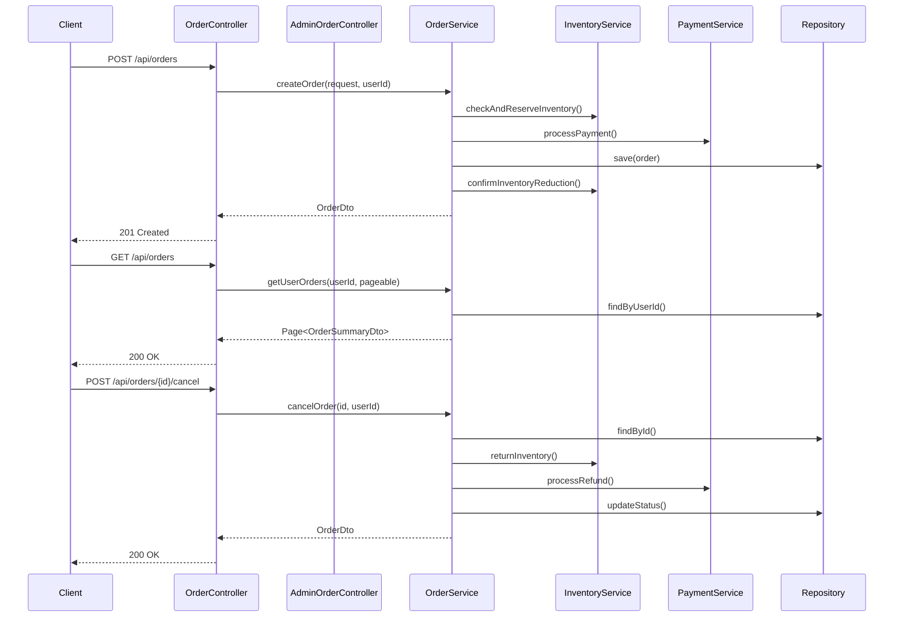
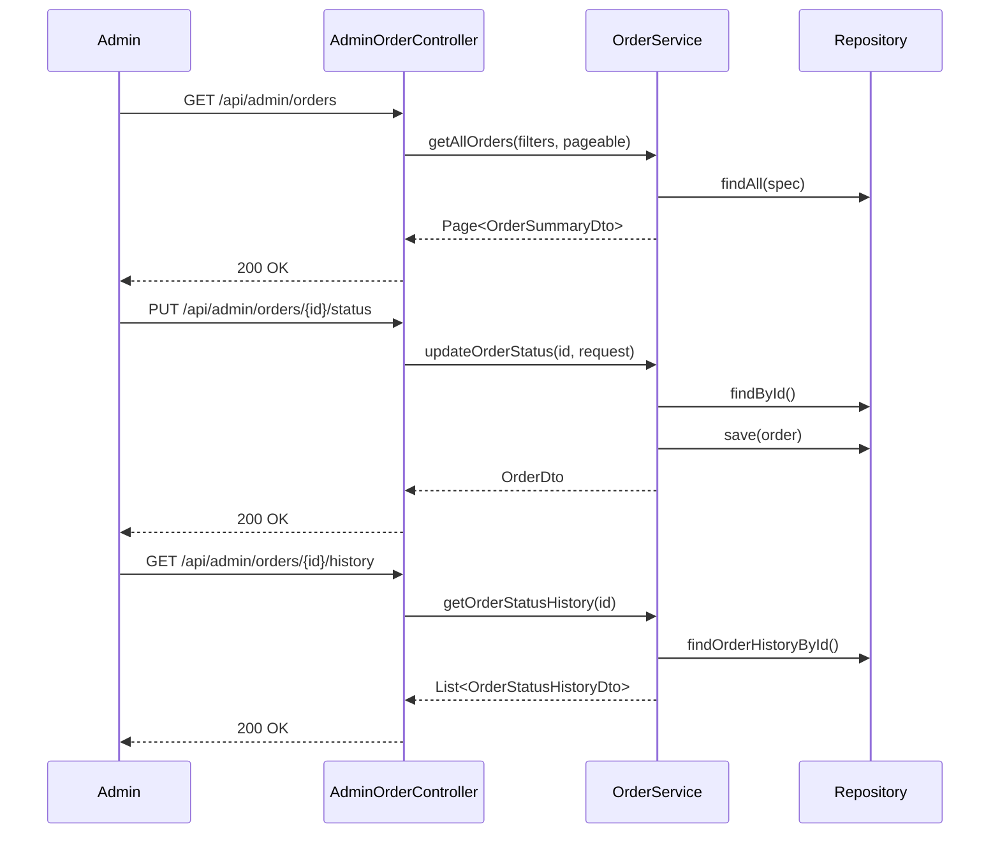

# Order Controller - Low Level Design

## Order Flow Sequence

## Admin Order Flow

## REST Controller (`OrderController.java`)
- Endpoints for creating an order, retrieving user's orders, retrieving a specific order, cancelling an order.
- Uses `@PreAuthorize` or similar for authorization checks (user owns order).

## Admin REST Controller (`AdminOrderController.java`)
- Endpoints for listing all orders (with filtering/pagination), updating order status, viewing order history.
- Secured with admin role checks.

## Request DTOs
- `CreateOrderRequest` (e.g., cartId, shippingAddressId, billingAddressId, paymentMethodId)
- `UpdateOrderStatusRequest` (Admin only: newStatus, notes)
- `CancelOrderRequest` (User initiated: reason)

## Response DTOs
- `OrderDto` (Detailed order view including items, addresses, status, totals)
- `OrderSummaryDto` (For listing orders: id, date, total, status, primary product image)
- `OrderStatusHistoryDto`

## Exception Handling
- Handling `OrderNotFoundException`.
- Handling invalid status transitions (`IllegalOrderStatusTransitionException`).
- Handling authorization failures.
- Handling inventory/payment issues during order creation.
