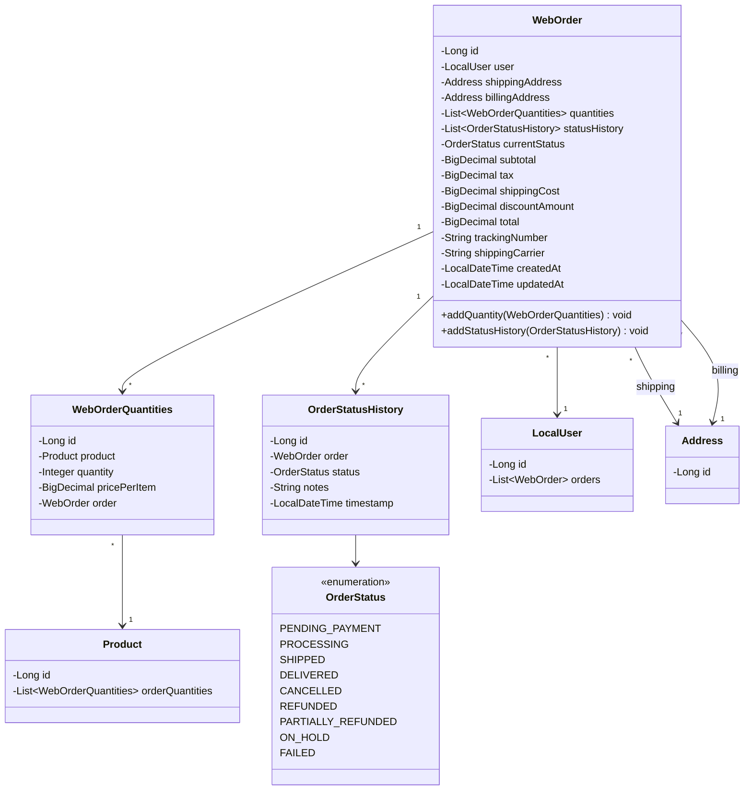

# Order Domain Models - Low Level Design

## Domain Model Class Diagram



## WebOrder Entity
```java
@Entity
@Table(name = "web_orders")
@Data
@NoArgsConstructor
@EntityListeners(AuditingEntityListener.class)
public class WebOrder {
    @Id
    @GeneratedValue(strategy = GenerationType.IDENTITY)
    private Long id;

    @ManyToOne(fetch = FetchType.LAZY, optional = false)
    @JoinColumn(name = "user_id", nullable = false)
    private LocalUser user;

    @ManyToOne(fetch = FetchType.LAZY, optional = false)
    @JoinColumn(name = "shipping_address_id", nullable = false)
    private Address shippingAddress;

    // Optional: Separate billing address if different
    @ManyToOne(fetch = FetchType.LAZY)
    @JoinColumn(name = "billing_address_id")
    private Address billingAddress;

    @OneToMany(
        mappedBy = "order",
        cascade = CascadeType.ALL,
        orphanRemoval = true,
        fetch = FetchType.LAZY
    )
    private List<WebOrderQuantities> quantities = new ArrayList<>();

    @OneToMany(
        mappedBy = "order",
        cascade = CascadeType.ALL,
        orphanRemoval = true,
        fetch = FetchType.LAZY
    )
    @OrderBy("timestamp DESC") // Show latest status first
    private List<OrderStatusHistory> statusHistory = new ArrayList<>();

    @Enumerated(EnumType.STRING)
    @Column(name = "current_status", nullable = false, length = 50)
    private OrderStatus currentStatus = OrderStatus.PENDING_PAYMENT;

    @Column(name = "subtotal", nullable = false, precision = 10, scale = 2)
    private BigDecimal subtotal;

    @Column(name = "tax", nullable = false, precision = 10, scale = 2)
    private BigDecimal tax;

    @Column(name = "shipping_cost", nullable = false, precision = 10, scale = 2)
    private BigDecimal shippingCost;

    @Column(name = "discount_amount", precision = 10, scale = 2)
    private BigDecimal discountAmount = BigDecimal.ZERO;

    @Column(name = "total", nullable = false, precision = 10, scale = 2)
    private BigDecimal total;

    @Column(name = "tracking_number", length = 100)
    private String trackingNumber;

    @Column(name = "shipping_carrier", length = 50)
    private String shippingCarrier;

    @CreatedDate
    @Column(name = "created_at", nullable = false, updatable = false)
    private LocalDateTime createdAt;

    @LastModifiedDate
    @Column(name = "updated_at")
    private LocalDateTime updatedAt;

    public void addQuantity(WebOrderQuantities quantity) {
        quantities.add(quantity);
        quantity.setOrder(this);
    }

    public void addStatusHistory(OrderStatusHistory historyEntry) {
        statusHistory.add(historyEntry);
        historyEntry.setOrder(this);
        this.currentStatus = historyEntry.getStatus(); // Update current status
    }
}
```

## WebOrderQuantities Entity (OrderItem)
```java
@Entity
@Table(name = "web_order_quantities")
@Data
@NoArgsConstructor
public class WebOrderQuantities {
    @Id
    @GeneratedValue(strategy = GenerationType.IDENTITY)
    private Long id;

    @ManyToOne(fetch = FetchType.LAZY, optional = false)
    @JoinColumn(name = "product_id", nullable = false)
    private Product product;

    @Column(nullable = false)
    private Integer quantity;

    @Column(name = "price_per_item", nullable = false, precision = 10, scale = 2) // Price at time of order
    private BigDecimal pricePerItem;

    @ManyToOne(fetch = FetchType.LAZY, optional = false)
    @JoinColumn(name = "order_id", nullable = false)
    private WebOrder order;
}
```

## OrderStatusHistory Entity
```java
@Entity
@Table(name = "order_status_history")
@Data
@NoArgsConstructor
@EntityListeners(AuditingEntityListener.class)
public class OrderStatusHistory {
    @Id
    @GeneratedValue(strategy = GenerationType.IDENTITY)
    private Long id;

    @ManyToOne(fetch = FetchType.LAZY, optional = false)
    @JoinColumn(name = "order_id", nullable = false)
    private WebOrder order;

    @Enumerated(EnumType.STRING)
    @Column(name = "status", nullable = false, length = 50)
    private OrderStatus status;

    @Column(name = "notes", columnDefinition = "TEXT")
    private String notes; // Optional notes, e.g., reason for cancellation

    @CreatedDate
    @Column(name = "timestamp", nullable = false, updatable = false)
    private LocalDateTime timestamp;
}
```

## OrderStatus Enum
```java
public enum OrderStatus {
    PENDING_PAYMENT, // Order created, awaiting payment confirmation
    PROCESSING,      // Payment received, order being processed
    SHIPPED,         // Order has been shipped
    DELIVERED,       // Order has been delivered
    CANCELLED,       // Order was cancelled (by user or admin)
    REFUNDED,        // Order was fully refunded
    PARTIALLY_REFUNDED, // Order was partially refunded
    ON_HOLD,         // Order processing is temporarily paused
    FAILED           // Order failed (e.g., payment failed definitively)
}
```

## Database Schema (Conceptual)
```mermaid
erDiagram
    WEB_ORDERS ||--o{ WEB_ORDER_QUANTITIES : contains
    WEB_ORDERS ||--o{ ORDER_STATUS_HISTORY : logs
    WEB_ORDERS }|--|| USERS : belongs_to
    WEB_ORDERS }|--|| ADDRESSES : ships_to
    WEB_ORDERS }|--|| ADDRESSES : bills_to
    WEB_ORDER_QUANTITIES }|--|| PRODUCTS : includes

    WEB_ORDERS {
        BIGINT id PK
        BIGINT user_id FK
        BIGINT shipping_address_id FK
        BIGINT billing_address_id FK "Optional"
        VARCHAR(50) current_status
        DECIMAL(10,2) subtotal
        DECIMAL(10,2) tax
        DECIMAL(10,2) shipping_cost
        DECIMAL(10,2) discount_amount
        DECIMAL(10,2) total
        VARCHAR(100) tracking_number "Nullable"
        VARCHAR(50) shipping_carrier "Nullable"
        TIMESTAMP created_at
        TIMESTAMP updated_at
    }

    WEB_ORDER_QUANTITIES {
        BIGINT id PK
        BIGINT order_id FK
        BIGINT product_id FK
        INT quantity
        DECIMAL(10,2) price_per_item
    }

    ORDER_STATUS_HISTORY {
        BIGINT id PK
        BIGINT order_id FK
        VARCHAR(50) status
        TEXT notes "Nullable"
        TIMESTAMP timestamp
    }

    USERS { BIGINT id PK }
    ADDRESSES { BIGINT id PK }
    PRODUCTS { BIGINT id PK }
