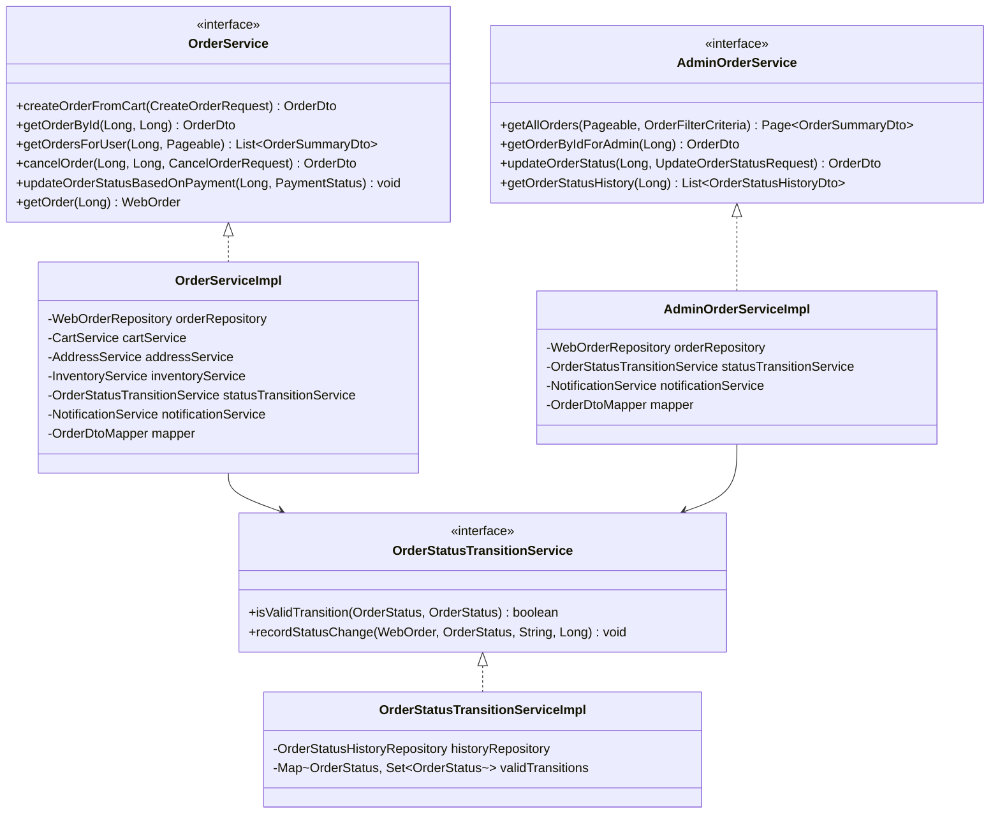

# Order Service - Low Level Design

## Service Layer Design



## Service Interfaces

### OrderService Interface
```java
public interface OrderService {
    OrderDto createOrderFromCart(CreateOrderRequest request);
    OrderDto getOrderById(Long orderId, Long userId); // User specific retrieval
    List<OrderSummaryDto> getOrdersForUser(Long userId, Pageable pageable);
    OrderDto cancelOrder(Long orderId, Long userId, CancelOrderRequest request);
    // Internal methods called by other services (e.g., PaymentService)
    void updateOrderStatusBasedOnPayment(Long orderId, PaymentStatus paymentStatus);
    WebOrder getOrder(Long orderId); // For internal service use
}
```

### AdminOrderService Interface
```java
public interface AdminOrderService {
    Page<OrderSummaryDto> getAllOrders(Pageable pageable, OrderFilterCriteria criteria);
    OrderDto getOrderByIdForAdmin(Long orderId);
    OrderDto updateOrderStatus(Long orderId, UpdateOrderStatusRequest request);
    List<OrderStatusHistoryDto> getOrderStatusHistory(Long orderId);
    // Potentially methods for refunds, adding notes etc.
}
```

### OrderStatusTransitionService Interface
```java
public interface OrderStatusTransitionService {
    boolean isValidTransition(OrderStatus currentStatus, OrderStatus nextStatus);
    void recordStatusChange(WebOrder order, OrderStatus newStatus, String notes, Long adminUserId); // adminUserId optional
}
```

## Implementation Classes

### OrderServiceImpl
```java
@Service
@Transactional
public class OrderServiceImpl implements OrderService {
    private final WebOrderRepository orderRepository;
    private final CartService cartService;
    private final AddressService addressService;
    private final InventoryService inventoryService;
    private final OrderStatusTransitionService statusTransitionService;
    private final NotificationService notificationService;
    private final OrderDtoMapper mapper;

    @Override
    public OrderDto createOrderFromCart(CreateOrderRequest request) {
        Cart cart = cartService.getCartEntity(request.getCartId()); // Assume CartService provides entity access
        // Validate cart, user, addresses etc.
        Address shippingAddress = addressService.getAddress(request.getShippingAddressId(), request.getUserId());
        // ... validation ...

        WebOrder order = new WebOrder();
        order.setUser(cart.getUser());
        order.setShippingAddress(shippingAddress);
        // Set billing address, calculate totals (subtotal, tax, shipping, discount)

        // Convert CartItems to WebOrderQuantities
        for (CartItem item : cart.getItems()) {
            inventoryService.decreaseStock(item.getProduct().getId(), item.getQuantity()); // Reserve stock
            WebOrderQuantities quantity = createOrderQuantity(item);
            order.addQuantity(quantity);
        }

        statusTransitionService.recordStatusChange(order, OrderStatus.PENDING_PAYMENT, "Order created", null);
        WebOrder savedOrder = orderRepository.save(order);

        cartService.markCartAsCompleted(request.getCartId()); // Mark cart used
        notificationService.sendOrderConfirmation(savedOrder);

        return mapper.toDto(savedOrder);
    }

    @Override
    public void updateOrderStatusBasedOnPayment(Long orderId, PaymentStatus paymentStatus) {
        WebOrder order = getOrder(orderId);
        OrderStatus nextStatus = determineNextOrderStatus(paymentStatus);
        if (statusTransitionService.isValidTransition(order.getCurrentStatus(), nextStatus)) {
            statusTransitionService.recordStatusChange(order, nextStatus, "Payment status: " + paymentStatus, null);
            orderRepository.save(order);
            // Trigger further actions based on status (e.g., notify fulfillment)
        } else {
            // Log error: Invalid transition attempt based on payment
        }
    }
    // ... other methods ...

    private OrderStatus determineNextOrderStatus(PaymentStatus paymentStatus) {
        switch (paymentStatus) {
            case SUCCESSFUL: return OrderStatus.PROCESSING;
            case FAILED: return OrderStatus.FAILED;
            // Handle other cases like PENDING, REQUIRES_ACTION if needed
            default: return OrderStatus.ON_HOLD; // Or keep PENDING_PAYMENT
        }
    }
}
```

### AdminOrderServiceImpl
```java
@Service
@Transactional
public class AdminOrderServiceImpl implements AdminOrderService {
    private final WebOrderRepository orderRepository;
    private final OrderStatusTransitionService statusTransitionService;
    private final NotificationService notificationService;
    private final OrderDtoMapper mapper;

    @Override
    @PreAuthorize("hasRole('ADMIN')") // Example security
    public OrderDto updateOrderStatus(Long orderId, UpdateOrderStatusRequest request) {
        WebOrder order = orderRepository.findById(orderId)
            .orElseThrow(() -> new OrderNotFoundException("Order not found"));

        if (statusTransitionService.isValidTransition(order.getCurrentStatus(), request.getNewStatus())) {
            statusTransitionService.recordStatusChange(order, request.getNewStatus(), request.getNotes(), request.getAdminUserId());
            WebOrder savedOrder = orderRepository.save(order);

            // Send notification if needed (e.g., shipped)
            if (request.getNewStatus() == OrderStatus.SHIPPED) {
                notificationService.sendShippingConfirmation(savedOrder, request.getTrackingNumber());
            }
            return mapper.toDto(savedOrder);
        } else {
            throw new IllegalOrderStatusTransitionException("Invalid status transition");
        }
    }
    // ... other admin methods ...
}
```

### OrderStatusTransitionServiceImpl
```java
@Service
public class OrderStatusTransitionServiceImpl implements OrderStatusTransitionService {
    private final OrderStatusHistoryRepository historyRepository;
    private static final Map<OrderStatus, Set<OrderStatus>> validTransitions = // Define valid transitions

    @Override
    public boolean isValidTransition(OrderStatus currentStatus, OrderStatus nextStatus) {
        return validTransitions.getOrDefault(currentStatus, Collections.emptySet()).contains(nextStatus);
    }

    @Override
    public void recordStatusChange(WebOrder order, OrderStatus newStatus, String notes, Long adminUserId) {
        OrderStatusHistory history = new OrderStatusHistory();
        history.setStatus(newStatus);
        history.setNotes(notes);
        // Set admin user ID if provided
        order.addStatusHistory(history); // This also updates order.currentStatus
    }
}
```

## Data Objects (Helper)

```java
@Data
public class OrderFilterCriteria { // For admin listing
    private OrderStatus status;
    private LocalDate dateFrom;
    private LocalDate dateTo;
    private Long userId;
}
