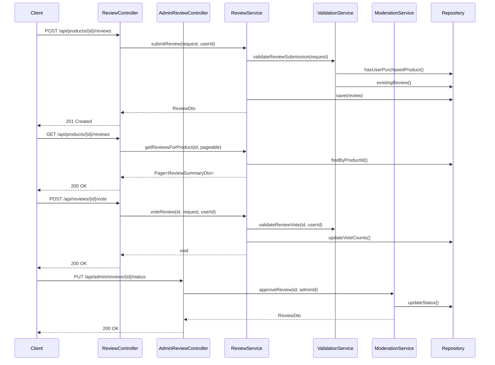

# Review Controller - Low Level Design

## Review Flow Sequence

## REST Controller (`ReviewController.java`)
- Endpoints for submitting a review, getting reviews for a product, getting a specific review, editing/deleting own review, voting on a review.
- Authorization checks (user purchased product to review, user owns review to edit/delete).

## Admin REST Controller (`AdminReviewController.java`)
- Endpoints for listing reviews needing moderation, approving/rejecting reviews.
- Secured with admin role checks.

## Request DTOs
- `SubmitReviewRequest` (productId, rating, title, body)
- `UpdateReviewRequest` (rating, title, body)
- `ReviewVoteRequest` (voteType: HELPFUL/UNHELPFUL)
- `ModerateReviewRequest` (Admin only: status: APPROVED/REJECTED, reason)

## Response DTOs
- `ReviewDto` (Includes review details, user info, product info, votes)
- `ReviewSummaryDto` (For listing: rating, title snippet, user name, date)
- `ProductRatingStatsDto` (averageRating, totalReviews, ratingCounts)

## Exception Handling
- Handling `ReviewNotFoundException`.
- Handling `UserNotPurchasedProductException`.
- Handling `DuplicateReviewException`.
- Handling authorization failures.
- Handling invalid input (e.g., rating out of range).
