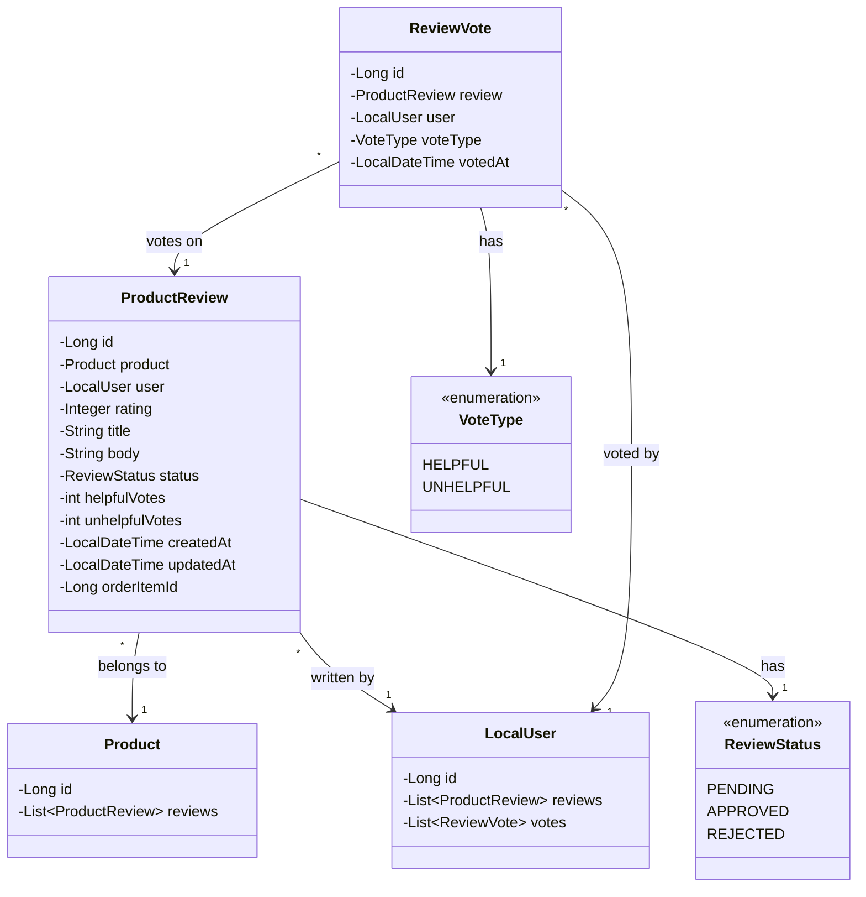

# Review Domain Models - Low Level Design

## Domain Model Class Diagram



## ProductReview Entity
```java
@Entity
@Table(name = "product_reviews", indexes = {
    @Index(name = "idx_review_product", columnList = "product_id"),
    @Index(name = "idx_review_user", columnList = "user_id"),
    @Index(name = "idx_review_status", columnList = "status")
})
@Data
@NoArgsConstructor
@EntityListeners(AuditingEntityListener.class)
public class ProductReview {
    @Id
    @GeneratedValue(strategy = GenerationType.IDENTITY)
    private Long id;

    @ManyToOne(fetch = FetchType.LAZY, optional = false)
    @JoinColumn(name = "product_id", nullable = false)
    private Product product;

    @ManyToOne(fetch = FetchType.LAZY, optional = false)
    @JoinColumn(name = "user_id", nullable = false)
    private LocalUser user;

    @Column(name = "rating", nullable = false)
    @Min(1) @Max(5)
    private Integer rating;

    @Column(name = "title", length = 255)
    private String title;

    @Column(name = "body", columnDefinition = "TEXT")
    private String body;

    @Enumerated(EnumType.STRING)
    @Column(name = "status", nullable = false, length = 50)
    private ReviewStatus status = ReviewStatus.PENDING;

    @Column(name = "helpful_votes", nullable = false)
    private int helpfulVotes = 0;

    @Column(name = "unhelpful_votes", nullable = false)
    private int unhelpfulVotes = 0;

    @CreatedDate
    @Column(name = "created_at", nullable = false, updatable = false)
    private LocalDateTime createdAt;

    @LastModifiedDate
    @Column(name = "updated_at")
    private LocalDateTime updatedAt;

    // Optional: Link to the order item to verify purchase
    @Column(name = "order_item_id")
    private Long orderItemId;
}
```

## ReviewVote Entity
```java
@Entity
@Table(name = "review_votes", uniqueConstraints = {
    @UniqueConstraint(columnNames = {"review_id", "user_id"}) // User can vote only once per review
})
@Data
@NoArgsConstructor
public class ReviewVote {
    @Id
    @GeneratedValue(strategy = GenerationType.IDENTITY)
    private Long id;

    @ManyToOne(fetch = FetchType.LAZY, optional = false)
    @JoinColumn(name = "review_id", nullable = false)
    private ProductReview review;

    @ManyToOne(fetch = FetchType.LAZY, optional = false)
    @JoinColumn(name = "user_id", nullable = false)
    private LocalUser user;

    @Enumerated(EnumType.STRING)
    @Column(name = "vote_type", nullable = false, length = 50)
    private VoteType voteType; // HELPFUL or UNHELPFUL

    @Column(name = "voted_at", nullable = false, updatable = false)
    private LocalDateTime votedAt = LocalDateTime.now();
}
```

## ReviewStatus Enum
```java
public enum ReviewStatus {
    PENDING,    // Awaiting moderation
    APPROVED,   // Visible to public
    REJECTED    // Not visible, reason might be stored elsewhere or in notes
}
```

## VoteType Enum
```java
public enum VoteType {
    HELPFUL,
    UNHELPFUL
}
```

## Database Schema (Conceptual)
```mermaid
erDiagram
    PRODUCT_REVIEWS }|--|| PRODUCTS : reviews
    PRODUCT_REVIEWS }|--|| USERS : written_by
    REVIEW_VOTES ||--|{ PRODUCT_REVIEWS : votes_for
    REVIEW_VOTES }|--|| USERS : voted_by

    PRODUCT_REVIEWS {
        BIGINT id PK
        BIGINT product_id FK
        BIGINT user_id FK
        INT rating
        VARCHAR(255) title "Nullable"
        TEXT body "Nullable"
        VARCHAR(50) status
        INT helpful_votes
        INT unhelpful_votes
        BIGINT order_item_id "Nullable, FK to OrderItems"
        TIMESTAMP created_at
        TIMESTAMP updated_at
    }

    REVIEW_VOTES {
        BIGINT id PK
        BIGINT review_id FK
        BIGINT user_id FK
        VARCHAR(50) vote_type
        TIMESTAMP voted_at
        UNIQUE (review_id, user_id)
    }

    PRODUCTS { BIGINT id PK }
    USERS { BIGINT id PK }
