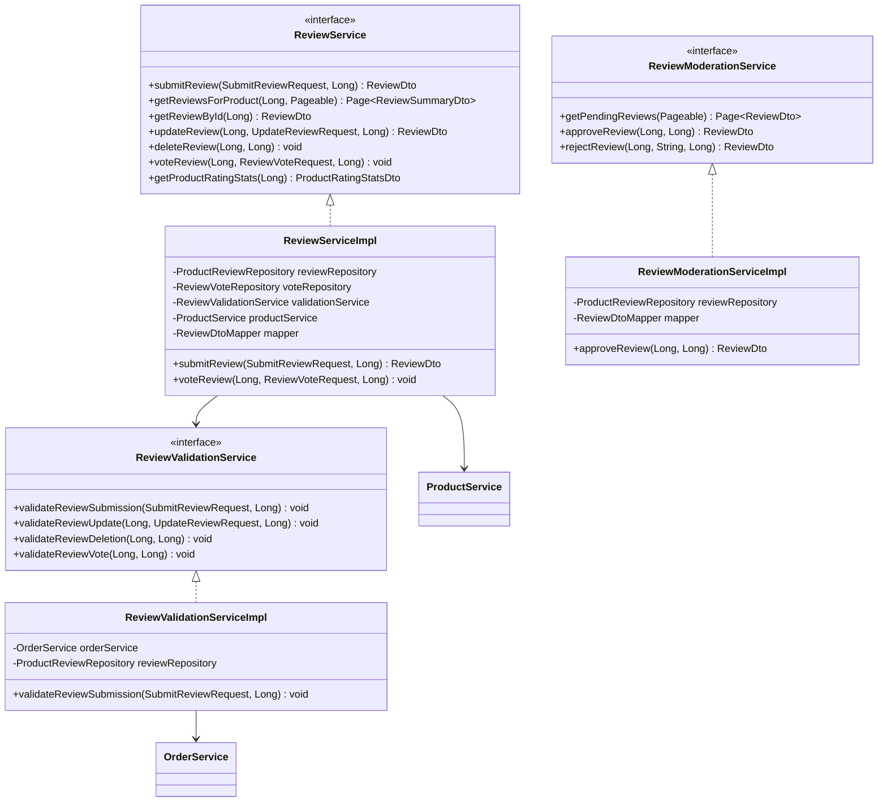

# Review Service - Low Level Design

## Service Layer Design



## Service Interfaces

### ReviewService Interface
```java
public interface ReviewService {
    ReviewDto submitReview(SubmitReviewRequest request, Long userId);
    Page<ReviewSummaryDto> getReviewsForProduct(Long productId, Pageable pageable);
    ReviewDto getReviewById(Long reviewId);
    ReviewDto updateReview(Long reviewId, UpdateReviewRequest request, Long userId);
    void deleteReview(Long reviewId, Long userId);
    void voteReview(Long reviewId, ReviewVoteRequest request, Long userId);
    ProductRatingStatsDto getProductRatingStats(Long productId);
}
```

### ReviewValidationService Interface
```java
public interface ReviewValidationService {
    void validateReviewSubmission(SubmitReviewRequest request, Long userId);
    void validateReviewUpdate(Long reviewId, UpdateReviewRequest request, Long userId);
    void validateReviewDeletion(Long reviewId, Long userId);
    void validateReviewVote(Long reviewId, Long userId);
}
```

### ReviewModerationService Interface
```java
public interface ReviewModerationService {
    Page<ReviewDto> getPendingReviews(Pageable pageable);
    ReviewDto approveReview(Long reviewId, Long adminUserId);
    ReviewDto rejectReview(Long reviewId, String reason, Long adminUserId);
}
```

## Implementation Classes

### ReviewServiceImpl
```java
@Service
@Transactional
public class ReviewServiceImpl implements ReviewService {
    private final ProductReviewRepository reviewRepository;
    private final ReviewVoteRepository voteRepository;
    private final ReviewValidationService validationService;
    private final ProductService productService; // To update product average rating
    private final ReviewDtoMapper mapper;

    @Override
    public ReviewDto submitReview(SubmitReviewRequest request, Long userId) {
        validationService.validateReviewSubmission(request, userId);

        ProductReview review = new ProductReview();
        // Map request to review entity
        review.setProduct(productService.getProductEntity(request.getProductId()));
        review.setUser(userService.getUserEntity(userId)); // Assuming UserService exists
        review.setRating(request.getRating());
        review.setTitle(request.getTitle());
        review.setBody(request.getBody());
        review.setStatus(ReviewStatus.PENDING); // Or APPROVED if auto-approve

        ProductReview savedReview = reviewRepository.save(review);
        updateProductAverageRating(request.getProductId());

        return mapper.toDto(savedReview);
    }

    @Override
    public void voteReview(Long reviewId, ReviewVoteRequest request, Long userId) {
        validationService.validateReviewVote(reviewId, userId);
        ProductReview review = findReview(reviewId);
        LocalUser user = userService.getUserEntity(userId);

        // Check if user already voted
        Optional<ReviewVote> existingVote = voteRepository.findByReviewAndUser(review, user);

        if (existingVote.isPresent()) {
            // Update existing vote if type changed, or remove if same type
            if (existingVote.get().getVoteType() == request.getVoteType()) {
                voteRepository.delete(existingVote.get());
                updateVoteCounts(review, request.getVoteType(), -1);
            } else {
                existingVote.get().setVoteType(request.getVoteType());
                voteRepository.save(existingVote.get());
                updateVoteCounts(review, request.getVoteType(), 1); // Increment new type
                updateVoteCounts(review, existingVote.get().getVoteType(), -1); // Decrement old type
            }
        } else {
            // Create new vote
            ReviewVote newVote = new ReviewVote();
            newVote.setReview(review);
            newVote.setUser(user);
            newVote.setVoteType(request.getVoteType());
            voteRepository.save(newVote);
            updateVoteCounts(review, request.getVoteType(), 1);
        }
        reviewRepository.save(review); // Save updated vote counts
    }

    private void updateVoteCounts(ProductReview review, VoteType type, int delta) {
        if (type == VoteType.HELPFUL) {
            review.setHelpfulVotes(review.getHelpfulVotes() + delta);
        } else {
            review.setUnhelpfulVotes(review.getUnhelpfulVotes() + delta);
        }
    }

    private void updateProductAverageRating(Long productId) {
        // Calculate and update average rating on the Product entity
        Double avgRating = reviewRepository.calculateAverageRating(productId, ReviewStatus.APPROVED);
        productService.updateAverageRating(productId, avgRating);
    }
    // ... other methods ...
}
```

### ReviewValidationServiceImpl
```java
@Service
public class ReviewValidationServiceImpl implements ReviewValidationService {
    private final OrderService orderService; // To check purchase history
    private final ProductReviewRepository reviewRepository;

    @Override
    public void validateReviewSubmission(SubmitReviewRequest request, Long userId) {
        // Check if user purchased the product
        if (!orderService.hasUserPurchasedProduct(userId, request.getProductId())) {
            throw new UserNotPurchasedProductException("User must purchase the product to review it.");
        }
        // Check if user already reviewed this product
        if (reviewRepository.existsByProduct_IdAndUser_Id(request.getProductId(), userId)) {
            throw new DuplicateReviewException("User has already reviewed this product.");
        }
    }
    // ... other validation methods ...
}
```

### ReviewModerationServiceImpl
```java
@Service
@Transactional
public class ReviewModerationServiceImpl implements ReviewModerationService {
    private final ProductReviewRepository reviewRepository;
    private final ReviewDtoMapper mapper;

    @Override
    @PreAuthorize("hasRole('ADMIN') or hasRole('MODERATOR')")
    public ReviewDto approveReview(Long reviewId, Long adminUserId) {
        ProductReview review = findReview(reviewId);
        review.setStatus(ReviewStatus.APPROVED);
        // Log admin action
        ProductReview savedReview = reviewRepository.save(review);
        // Update product average rating after approval
        // updateProductAverageRating(review.getProduct().getId()); -> Call ReviewService method or duplicate logic
        return mapper.toDto(savedReview);
    }
    // ... reject method ...
}
