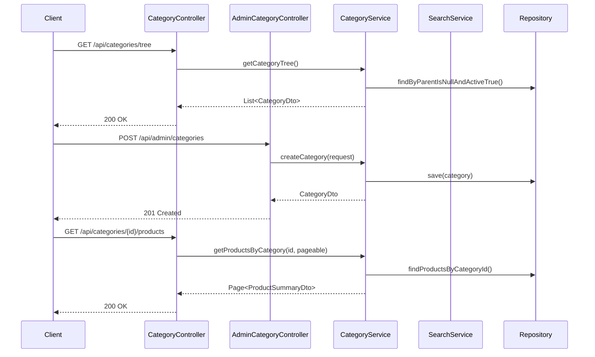
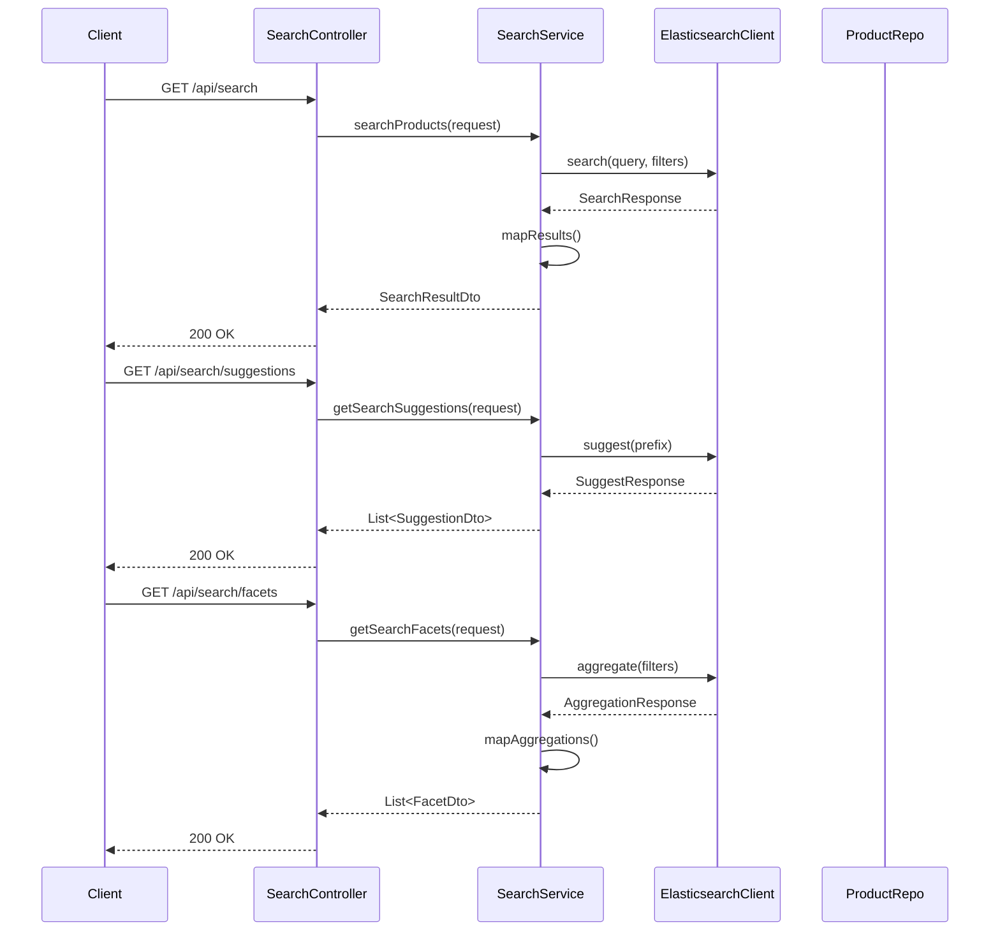

# Category & Search Controllers - Low Level Design

## Category Operations Flow

## Search Operations Flow

## Category REST Controller (`CategoryController.java`)
- Endpoints for retrieving the category tree, getting products by category.
- Publicly accessible.

## Admin Category REST Controller (`AdminCategoryController.java`)
- Endpoints for creating, updating, deleting categories, assigning products to categories.
- Secured with admin role checks.

## Search REST Controller (`SearchController.java`)
- Endpoints for performing product searches, getting search suggestions, retrieving filter facets.
- Publicly accessible.

## Request DTOs
- `CreateCategoryRequest` (Admin: name, slug, description, parentId, imageUrl)
- `UpdateCategoryRequest` (Admin: name, slug, description, parentId, imageUrl)
- `AssignProductCategoryRequest` (Admin: productId, categoryId)
- `SearchRequest` (query, filters map, sort field, sort direction, page, size)
- `SuggestionRequest` (prefix)

## Response DTOs
- `CategoryDto` (id, name, slug, children list)
- `CategoryDetailDto` (Includes description, parent, attributes)
- `ProductSummaryDto` (Used in category product listing and search results)
- `SearchResultDto` (List<ProductSummaryDto>, pagination info, facets)
- `SuggestionDto` (List<String>)
- `FacetDto` (filterName, List<FacetValueDto>)
- `FacetValueDto` (value, count)

## Exception Handling
- Handling `CategoryNotFoundException`.
- Handling `SearchEngineUnavailableException`.
- Handling invalid search/filter parameters.
- Handling authorization failures for admin endpoints.
