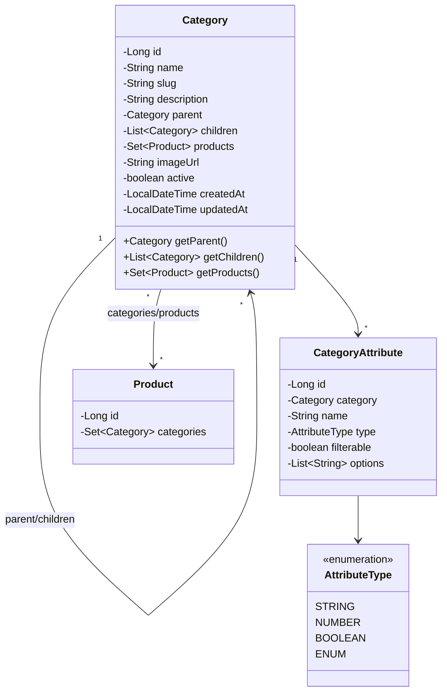

# Category Domain Models - Low Level Design

## Domain Model Class Diagram



## Category Entity
```java
@Entity
@Table(name = "categories")
@Data
@NoArgsConstructor
@EntityListeners(AuditingEntityListener.class)
public class Category {
    @Id
    @GeneratedValue(strategy = GenerationType.IDENTITY)
    private Long id;

    @Column(nullable = false, length = 100)
    private String name;

    @Column(nullable = false, unique = true, length = 150)
    private String slug;

    @Column(columnDefinition = "TEXT")
    private String description;

    @ManyToOne(fetch = FetchType.LAZY)
    @JoinColumn(name = "parent_id")
    private Category parent;

    @OneToMany(mappedBy = "parent", cascade = CascadeType.ALL, fetch = FetchType.LAZY)
    private List<Category> children = new ArrayList<>();

    @ManyToMany(mappedBy = "categories", fetch = FetchType.LAZY)
    private Set<Product> products = new HashSet<>();

    // Optional: For storing category-specific attributes/filters
    // @OneToMany(mappedBy = "category", cascade = CascadeType.ALL, orphanRemoval = true)
    // private List<CategoryAttribute> attributes = new ArrayList<>();

    @Column(name = "image_url", length = 255)
    private String imageUrl;

    @Column(nullable = false)
    private boolean active = true;

    @CreatedDate
    @Column(name = "created_at", nullable = false, updatable = false)
    private LocalDateTime createdAt;

    @LastModifiedDate
    @Column(name = "updated_at")
    private LocalDateTime updatedAt;

    // Helper methods for hierarchy if needed
}
```

## CategoryAttribute Entity (Optional - If implementing dynamic attributes)
```java
/*
@Entity
@Table(name = "category_attributes")
@Data
@NoArgsConstructor
public class CategoryAttribute {
    @Id
    @GeneratedValue(strategy = GenerationType.IDENTITY)
    private Long id;

    @ManyToOne(fetch = FetchType.LAZY, optional = false)
    @JoinColumn(name = "category_id", nullable = false)
    private Category category;

    @Column(nullable = false, length = 100)
    private String name; // e.g., "Color", "Size", "Material"

    @Enumerated(EnumType.STRING)
    @Column(name = "type", nullable = false, length = 50)
    private AttributeType type; // e.g., STRING, NUMBER, BOOLEAN, ENUM

    @Column(nullable = false)
    private boolean filterable = true; // Can this attribute be used for filtering?

    // For ENUM type
    @ElementCollection(fetch = FetchType.LAZY)
    @CollectionTable(name = "category_attribute_options", joinColumns = @JoinColumn(name = "attribute_id"))
    @Column(name = "option_value")
    private List<String> options = new ArrayList<>();
}

public enum AttributeType {
    STRING, NUMBER, BOOLEAN, ENUM
}
*/
```

## Database Schema (Conceptual)
```mermaid
erDiagram
    CATEGORIES ||--o{ CATEGORIES : "has children"
    CATEGORIES }|--|| CATEGORIES : "has parent (optional)"
    CATEGORIES ||--|{ PRODUCTS_CATEGORIES : "associated via"
    PRODUCTS ||--|{ PRODUCTS_CATEGORIES : "associated via"
    PRODUCTS { BIGINT id PK }

    CATEGORIES {
        BIGINT id PK
        VARCHAR(100) name
        VARCHAR(150) slug UK
        TEXT description "Nullable"
        BIGINT parent_id FK "Nullable"
        VARCHAR(255) image_url "Nullable"
        BOOLEAN active
        TIMESTAMP created_at
        TIMESTAMP updated_at
    }

    PRODUCTS_CATEGORIES {
        BIGINT product_id PK, FK
        BIGINT category_id PK, FK
    }

    # Optional Attribute Schema
    # CATEGORIES ||--o{ CATEGORY_ATTRIBUTES : "has"
    # CATEGORY_ATTRIBUTES ||--o{ CATEGORY_ATTRIBUTE_OPTIONS : "has options (if ENUM)"
    #
    # CATEGORY_ATTRIBUTES {
    #     BIGINT id PK
    #     BIGINT category_id FK
    #     VARCHAR(100) name
    #     VARCHAR(50) type
    #     BOOLEAN filterable
    # }
    #
    # CATEGORY_ATTRIBUTE_OPTIONS {
    #     BIGINT attribute_id PK, FK
    #     VARCHAR option_value PK
    # }
