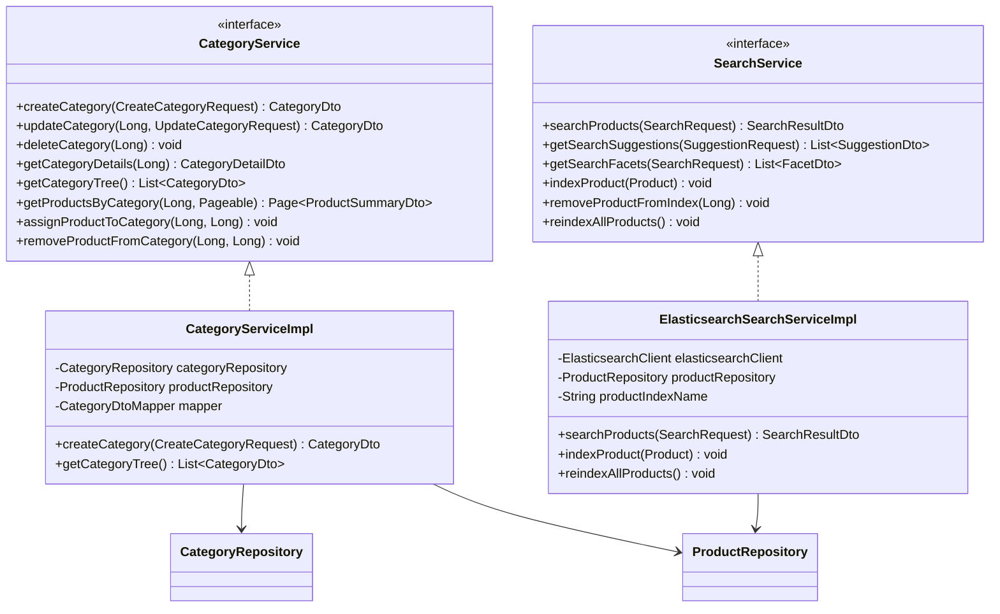

# Category & Search Services - Low Level Design

## Service Layer Design



## Service Interfaces

### CategoryService Interface
```java
public interface CategoryService {
    CategoryDto createCategory(CreateCategoryRequest request);
    CategoryDto updateCategory(Long categoryId, UpdateCategoryRequest request);
    void deleteCategory(Long categoryId);
    CategoryDetailDto getCategoryDetails(Long categoryId);
    List<CategoryDto> getCategoryTree(); // Returns root categories with children nested
    Page<ProductSummaryDto> getProductsByCategory(Long categoryId, Pageable pageable);
    void assignProductToCategory(Long productId, Long categoryId);
    void removeProductFromCategory(Long productId, Long categoryId);
    Category getCategoryEntity(Long categoryId); // For internal use
}
```

### SearchService Interface
```java
public interface SearchService {
    SearchResultDto searchProducts(SearchRequest request);
    List<SuggestionDto> getSearchSuggestions(SuggestionRequest request);
    List<FacetDto> getSearchFacets(SearchRequest request); // Get available filters based on current query/filters
    void indexProduct(Product product); // Called on product create/update
    void removeProductFromIndex(Long productId); // Called on product delete
    void bulkIndexProducts(List<Product> products);
    void reindexAllProducts(); // Admin action
}
```

## Implementation Classes

### CategoryServiceImpl
```java
@Service
@Transactional
public class CategoryServiceImpl implements CategoryService {
    private final CategoryRepository categoryRepository;
    private final ProductRepository productRepository; // Assuming ProductRepository exists
    private final CategoryDtoMapper mapper;

    @Override
    public CategoryDto createCategory(CreateCategoryRequest request) {
        // Validate request, check for slug uniqueness
        Category category = new Category();
        mapper.updateEntityFromCreateRequest(request, category); // Use mapper helper
        if (request.getParentId() != null) {
            Category parent = getCategoryEntity(request.getParentId());
            category.setParent(parent);
        }
        Category savedCategory = categoryRepository.save(category);
        return mapper.toDto(savedCategory);
    }

    @Override
    public List<CategoryDto> getCategoryTree() {
        List<Category> rootCategories = categoryRepository.findByParentIsNullAndActiveTrue();
        return rootCategories.stream()
            .map(mapper::toDtoWithChildren) // Recursive mapping
            .collect(Collectors.toList());
    }
    // ... other methods ...
}
```

### ElasticsearchSearchServiceImpl (Example Search Engine Implementation)
```java
@Service
public class ElasticsearchSearchServiceImpl implements SearchService {
    private final ElasticsearchClient elasticsearchClient; // High-level REST client
    private final ProductRepository productRepository; // For reindexing
    private final String productIndexName = "products"; // Configurable index name

    @Override
    public SearchResultDto searchProducts(SearchRequest request) {
        // Build Elasticsearch query based on request.query, request.filters, request.sort
        SearchResponse<ProductIndexDocument> response = elasticsearchClient.search(s -> s
            .index(productIndexName)
            .query(buildQuery(request))
            .sort(buildSort(request))
            .from(request.getPage() * request.getSize())
            .size(request.getSize())
            .aggregations(buildFacets()), // Define aggregations for facets
            ProductIndexDocument.class
        );

        // Map Elasticsearch hits to ProductSummaryDto
        List<ProductSummaryDto> products = mapHitsToProducts(response.hits().hits());
        // Extract facets from aggregations
        List<FacetDto> facets = mapAggregationsToFacets(response.aggregations());
        // Create PaginationInfo

        return new SearchResultDto(products, paginationInfo, facets);
    }

    @Override
    public void indexProduct(Product product) {
        ProductIndexDocument doc = mapProductToIndexDocument(product);
        elasticsearchClient.index(i -> i
            .index(productIndexName)
            .id(product.getId().toString())
            .document(doc)
        );
    }

    @Override
    public void reindexAllProducts() {
        // Fetch products in batches and index them
        // Consider using Elasticsearch Bulk API for efficiency
    }

    // Helper methods: buildQuery, buildSort, buildFacets, mapHitsToProducts, mapAggregationsToFacets, mapProductToIndexDocument
    // ...
}
```

## Data Objects (Helper)

```java
// Defined in controller.md: SearchRequest, SuggestionRequest, SearchResultDto, SuggestionDto, FacetDto, FacetValueDto

@Data // Internal representation for Elasticsearch document
public class ProductIndexDocument {
    private Long id;
    private String name;
    private String description;
    private String brand;
    private BigDecimal price;
    private List<String> categoryNames;
    private List<Long> categoryIds;
    private Map<String, Object> attributes; // Flexible attributes
    private Double averageRating;
    private Boolean inStock;
    // Add other searchable/filterable fields
}
